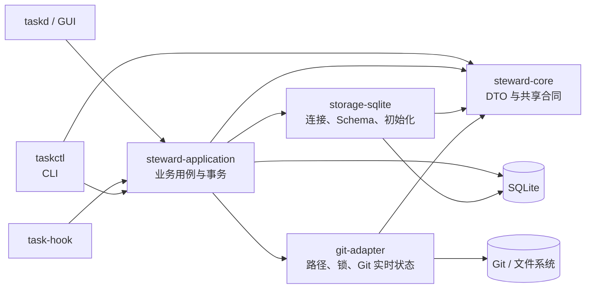

# Agent Steward Code Map

本文件是当前仓库的代码导航入口。它描述已经存在的实现边界、主要调用链、权威数据源和测试位置，不代替 API 文档或产品设计文档。

## 1. 实现状态

- 当前可运行实现是 Cargo workspace 中的 V0 `taskctl`、通用元数据适配器 `task-hook` 和本地 HTTP/GUI `taskd`。
- `docs/v0/` 是 V0 独立合同和当前参考实现的行为依据。
- #34 新增轻量 Project 名称/`##ID`、独立 revision/History 与 Task projectId；当前开发数据库 Schema 4 仅初始化空库，拒绝旧 Schema 2/3。组件/源码根登记、Task 组件范围及项目候选定位已实现，事实缓存尚未实现，见 [`docs/v0/16-项目与上下文复用.md`](docs/v0/16-项目与上下文复用.md)。
- `docs/v1/` 是 Workspace、Repository Registry、Task Review、Daemon、TUI/GUI 和 MCP 等独立设计，尚未对应到当前代码模块。
- V0、V1 以及未来可能出现的 V2 不是连续升级链；代码、合同和完成度不得跨版本自动继承，只有专项文档明确声明时才存在特定复用或迁移关系。
- V0 `taskd` 是独立的本地 HTTP 入口，不代表 V1 同名组件已经实现。不要把 V1 文档中的 `steward-tui`、`steward-gui`、`stewardctl` 或 `steward-mcp` 当作已经存在的组件。

## 2. Workspace 与依赖方向

Workspace 定义位于 [`Cargo.toml`](Cargo.toml)，包含六个 crate：



依赖必须保持从入口和用例层指向合同与基础设施层；`core` 不依赖 Application、SQLite 或 Git。

## 3. Crate 与模块导航

| 区域 | 代码入口 | 主要职责 |
| --- | --- | --- |
| CLI | [`crates/cli/src/main.rs`](crates/cli/src/main.rs) | Clap 命令树、UTF-8 文件/stdin JSON 输入、Task 列表视图与表格/lines 渲染、context/resume Markdown 摘要、危险操作确认、调用 `Service`、JSON envelope、退出码和权限警告 |
| Hook 适配器 | [`crates/cli/src/bin/task-hook.rs`](crates/cli/src/bin/task-hook.rs) | 显式绑定的通用宿主事件投影、有界读取和 busy 重试，不保留正文 |
| Session 观测 | [`crates/application/src/hooks.rs`](crates/application/src/hooks.rs) | 一次性绑定、独立事件接收、去重、分页、容量与清除 |
| 共用权限告警 | [`crates/application/src/permissions.rs`](crates/application/src/permissions.rs) | CLI/HTTP 共用数据库目录及 WAL/SHM 权限检查 |
| 本地 Daemon | [`crates/server/src/lib.rs`](crates/server/src/lib.rs) | 同源 HTTP、管理员/只读授权、一次性自动连接、严格 Command DTO、Application 调用 |
| Windows 本地更新 | [`distribution/windows/update-local.ps1`](distribution/windows/update-local.ps1) | 当前源码独立缓存编译、唯一构建 ID、复用受管服务正常停止与失败恢复；入口 Update-Local.cmd |
| Windows 启动器 | [`distribution/windows/steward.ps1`](distribution/windows/steward.ps1) | 固定配置、PID/启动时间/路径校验、正常停止、发布包校验与切换；不接管用户进程 |
| 本机身份 | [`crates/server/src/credentials.rs`](crates/server/src/credentials.rs) | 首次创建私有管理员/只读凭据、跨重启复用、拒绝损坏或不安全文件 |
| 浏览器授权 | [`crates/server/src/browser_auth.rs`](crates/server/src/browser_auth.rs) | 持久 HttpOnly Cookie 授权哈希、角色/凭据/origin 绑定、过期和撤销；不改业务库 Schema |
| 实时通知 | [`crates/server/src/events.rs`](crates/server/src/events.rs) | 有界认证 SSE、SQLite data_version 观察、CLI/Hook 提交通知、退出释放订阅 |
| GUI | [`crates/server/web/app.js`](crates/server/web/app.js) | 原生 DOM 任务工作台；静态资源嵌入二进制，无前端构建依赖 |
| Application 门面 | [`crates/application/src/lib.rs`](crates/application/src/lib.rs) | `Service`、`Outcome`、稳定错误映射、部分外部状态和恢复命令 |
| 项目用例 | [`crates/application/src/projects.rs`](crates/application/src/projects.rs) | Project create/show/list/rename/history、Task 项目归属 CAS；不操作 Git 或 Session |
| 项目合同 | [`crates/core/src/projects.rs`](crates/core/src/projects.rs) | ProjectView、名称 NFC/ASCII 大小写唯一键、数字/##ID/名称解析 |
| 组件与源码关联 | [`crates/application/src/sources.rs`](crates/application/src/sources.rs) | Project 组件/SourceRoot CAS、Repository 身份登记、Task 组件范围、目录候选与显式 Worktree 路径解析；不执行 Git 写入 |
| Pi 实验采集器 | [`integrations/pi/context-evidence.mjs`](integrations/pi/context-evidence.mjs) | 公开 API 的分阶段加载文本/工具元数据摘要；无自动入口、无注入/持久化，不自动转换 Rust HostEvidence；隔离真实 Pi 测试见 integrations/tests/pi-context.test.mjs |
| 宿主证据应用绑定 | [`crates/application/src/host_context.rs`](crates/application/src/host_context.rs) | 从当前数据库 Task/Session 与实时项目上下文独立派生请求范围，核验前后重算；不从报告自证、不授予复用 |
| 宿主证据基础库 | [`crates/core/src/host_evidence.rs`](crates/core/src/host_evidence.rs)、[`crates/application/src/host_evidence.rs`](crates/application/src/host_evidence.rs) | 严格协议/绑定/有效期与规则文件复核；只校验宿主报告，不认证宿主、不授予复用，不接入 CLI/Pi |
| 项目管理 HTTP/页面 | [`crates/server/src/projects.rs`](crates/server/src/projects.rs)、[`crates/server/web/app.js`](crates/server/web/app.js) | 项目/组件/源码只读路由及导航、独立Project/Task CAS命令、管理页面和任务筛选；access.projectManagement能力协商，reader不可写；人工验收见第17篇 |
| 显式项目上下文 | [`crates/application/src/project_context.rs`](crates/application/src/project_context.rs) | 实时导航/显式片段、Git 前后证据、来源指纹、复用 blocker 与 JSON data 预算；按单轮父目录合并边界核验，不跨调用缓存 |
| 源码合同 | [`crates/core/src/sources.rs`](crates/core/src/sources.rs) | Component/SourceRoot DTO 与便携相对路径校验 |
| 源目录观察 | [`crates/git-adapter/src/sources.rs`](crates/git-adapter/src/sources.rs) | checkout 根解析、Git 标记识别、活跃身份与持久记录分离、新观察匹配与别名比较；context_git_state 提供 unborn/detached/dirty porcelain-v2 证据 |
| Task 用例 | [`crates/application/src/tasks.rs`](crates/application/src/tasks.rs) | Task create/show/list 筛选与游标分页/字段投影、update/retitle/note/block/unblock/close/claim/checkpoint |
| Session 用例 | [`crates/application/src/sessions.rs`](crates/application/src/sessions.rs) | Session show/list/attach/close、Task here/context/resume、Session Import、History 和 doctor |
| Worktree 用例 | [`crates/application/src/worktrees.rs`](crates/application/src/worktrees.rs) | Worktree status/create/remove/adopt/detach，以及 Git 与 SQLite 的部分完成处理 |
| SQL 映射 | [`crates/application/src/db.rs`](crates/application/src/db.rs) | 数字/`#数字`/`taskKey` 引用解析、常用查询、row 到 DTO 的转换、version 检查、Task version 递增和 History 插入 |
| 核心合同 | [`crates/core/src/lib.rs`](crates/core/src/lib.rs) | Task 状态、输入/输出 DTO、共享校验、默认数据目录和跨平台私有权限工具 |
| v7 归档迁移 | [`crates/application/src/migration.rs`](crates/application/src/migration.rs) | 显式只读 v7 归档、闭合任务范围校验、逐字段复制核验、新库不覆盖发布；`database import-v7` |
| SQLite 基础设施 | [`crates/storage-sqlite/src/lib.rs`](crates/storage-sqlite/src/lib.rs) | 数据库打开、busy timeout、外键、WAL、单一 Schema 原子初始化和数据库路径规范化 |
| Git 基础设施 | [`crates/git-adapter/src/lib.rs`](crates/git-adapter/src/lib.rs) | CanonicalPath、含实时 common-dir 关联复核的 Repository identity、任务级 advisory lock、Worktree 命令和实时状态 |
| Git 读取资源边界 | [`crates/git-adapter/src/read_process.rs`](crates/git-adapter/src/read_process.rs) | 流式双输出上限、共享读截止时间/取消作用域、Windows Job / Unix 进程组清理；HTTP Source resolve/context、Task context/worktree-status、doctor 共用，不套用普通 Worktree 写取消 |

### 实际持久化边界

Application 当前会直接使用 `rusqlite` 编写事务和 SQL；`storage-sqlite` 负责数据库生命周期、Schema 初始化，但不是完整的 Repository 抽象层。代码地图应反映这个实际边界，不把设计目标写成现状。

## 4. 权威数据边界

| 事实 | 权威来源 | 读取入口 |
| --- | --- | --- |
| Project、组件、SourceRoot、Repository 登记、项目 History、Task 项目/组件范围 | SQLite | `projects.rs`、`sources.rs`、`tasks.rs`；项目 revision 与 Task version 独立，登记的路径身份只作实时复核基准 |
| Task、Session、Checkpoint、Note、Import、History | SQLite | Application Service 和 `db.rs` |
| Task version 与当前 Session 引用 | SQLite | `Service::task_*`、`Service::session_*` |
| Repository、Branch、Worktree 的登记引用 | SQLite | Task 的 repository/worktree 字段 |
| HEAD、dirty、staged、unstaged、untracked、ignored | Git 实时状态 | `git_adapter::observe_status` |
| Worktree 路径是否存在、Git 是否仍登记 | 文件系统与 Git | `git_adapter::find_worktree`、`find_worktree_registration`、`observe_status` |
| CLI JSON 合同和稳定错误码 | CLI/Application | `Envelope`、`AppError` |

数据库中的 Worktree 引用不能代替 Git 现场；Git 实时状态也不能自动改写 Task 状态。

## 5. 功能路由

| 能力 | CLI 命令类型 | Application 入口 | 外部依赖 | 主测试 |
| --- | --- | --- | --- | --- |
| Task 生命周期 | `TaskCommand` | `tasks.rs` 中的 `Service::task_*` | SQLite | `v0_flow.rs`、`cli_contract.rs` |
| Session 连续性 | `SessionCommand` | `sessions.rs` 中的 attach/close/resume | SQLite | `v0_flow.rs` |
| Session Import | `ImportCommand` | `session_import_add/list/remove` | 文件系统、SQLite | `v0_flow.rs`、`cli_contract.rs` |
| Worktree 管理 | `WorktreeCommand` | `worktree_create/remove/adopt/detach` | Git、文件系统、SQLite | `v0_flow.rs` |
| History | `TopCommand::History` | `Service::history` | SQLite | `v0_flow.rs` |
| 诊断 | `TopCommand::Doctor` | `Service::doctor` | SQLite、Git、文件系统 | `v0_flow.rs`、`cli_contract.rs` |

CLI 的集中路由位于 `main.rs` 的 `dispatch`。Application 的公开操作统一实现为 `Service` 方法，具体 `impl Service` 分布在 `tasks.rs`、`sessions.rs` 和 `worktrees.rs`。

## 6. 关键调用链

### Task mutation

```text
taskctl 参数（12 / #12 / taskKey）
  → CLI dispatch
  → Service::task_*
  → 解析为数据库数字 Task ID
  → 打开 SQLite 连接并 BEGIN IMMEDIATE
  → 读取 Task + 校验 expected version
  → 更新聚合状态
  → 写入 History
  → 在同一事务中构造响应快照
  → commit
  → CLI envelope
```

### 只读定位与交接

`Service::task_here` 从当前目录与实时 common-dir 查找已登记任务，返回候选；`Service::task_context` 在读事务中取得 Task、Project、最新 Checkpoint、当前 Session 和检查点之后的新 Notes（按 History sequence，最多最新 50 条，超限明确告警），释放事务后观察 Git。两者不修改 Task/Session/History。CLI 以表格展示 here，以 Markdown 展示 context；resume 复用摘要渲染。

### Session resume

```text
task show 取得 version
  → Service::task_resume
  → mutation 前解码最新 Checkpoint
  → 写事务中复核 Task/version/来源 Session
  → 创建全新 Session，并保存 continuedFrom
  → 更新 currentSessionId + History
  → 返回 Task、Checkpoint、Session 列表和实时 Worktree 上下文
```

### Session Import

```text
显式敏感内容确认
  → 规范化并验证普通文件
  → 固定缓冲区有界读取 + SHA-256
  → BEGIN IMMEDIATE
  → Task version 与 Session 归属校验
  → sessionId + sha256 去重
  → 保存 BLOB、递增 Task version、写入 History
  → commit
```

### Worktree mutation

```text
taskctl worktree ...
  → 获取 database + 数字 taskId 派生的跨进程 advisory lock
  → 读取 Task 并校验 version/登记引用
  → CanonicalPath + Repository common-dir 身份检查
  → create/remove 执行 Git mutation；adopt/detach 执行恢复前置观察
  → Git mutation 后重观测现场，并在数据库写入前复核目标状态
  → create/adopt 证明目录、Worktree 根、Branch 与 common-dir 一致；remove/detach 证明清除前置条件成立
  → create/adopt 在 BEGIN IMMEDIATE 中实时扫描全部 Worktree Owner；detach 对缺失登记使用规范化精确路径查询 Git
  → 验证通过后执行 SQLite CAS + History
  → 数据库提交后的再次观察
  → success 或 PARTIAL_EXTERNAL_STATE + 显式恢复命令
```

Git 命令不得在 SQLite 写事务中执行。`create/remove/adopt/detach` 持有同一 Task 的 advisory lock，直到数据库结果和后置观察已经分类。

## 7. 核心不变量与高风险区域

- Task 主键是 SQLite 自动生成且不复用的整数；`taskKey` 可空、唯一，且只能从 `NULL` 设置一次。JSON DTO 使用整数 `id/taskId`，人类输出显示 `#id`。
- 除没有旧状态可比较的创建外，所有面向已有 Task 的 mutation 都使用调用方提供的 expected version；发生 `VERSION_CONFLICT` 后必须重新读取。
- Task 的 title/goal/scope/acceptanceCriteria 初始可空以支持最小创建和增量补全；设置为字符串后不可清空，`close completed` 前四项必须完整。新写入的 title 必须符合 `MMDD｜类型｜主题`；closed Task 只能通过 CAS `retitle` 修正 title，不得借此重开或修改其他字段。
- Task mutation 与对应 History 必须在同一事务中提交或回滚；Worktree 创建的数据库阶段失败时，先释放事务，再观察现场并生成恢复建议。
- Task list 游标用固定长度 SHA-256 摘要绑定 status/taskKey/query 筛选，排序固定为 `updatedAt DESC, id ASC`；字段投影不参与游标计算，默认 JSON 仍返回完整 TaskView。
- 普通数据库连接只支持当前单一 Schema；仅空数据库允许初始化，不提供隐式旧版本升级。独立 `database import-v7` 只读旧版已关闭任务归档，并向不存在的新库发布校验后的副本，不改源、不合并、不自动切换配置。
- Task 的 Repository、common-dir、Branch、Worktree 四个引用必须全有或全空。
- 路径先从最近已存在祖先规范化；规范化目标完全相同时直接判等，两条路径都存在时比较文件对象身份。缺失路径只接受规范化后的精确拼写，不探测或模拟大小写及 Unicode 比较规则，也不持久化路径比较键。`create/adopt` 在写事务内扫描现有引用，确保同一实际 Worktree 只有一个 Task；中文路径可以创建、采纳和清理。
- Repository identity 复核不仅验证原 Repository 根和 common-dir 文件对象仍存在且未被替换，还必须重新解析当前 `git rev-parse --git-common-dir` 并证明关联仍指向原 common-dir。
- V0 SQLite/JSON 路径合同只接受 UTF-8；Repository、Worktree 或 Git porcelain 中的路径不能无损表示时必须明确拒绝，禁止使用有损替换字符继续操作。
- Task 当前 Session 必须属于同一 Task 且尚未结束。
- Checkpoint 必须引用同一 Task 的 Session；持久化 JSON 解码失败不能静默转换为空值。
- Session Import 未显式确认敏感内容时，不读取文件、不执行数据库 mutation。
- Worktree 删除拒绝 staged、unstaged、untracked 和 ignored 文件；系统不隐式执行 `push`、`force`、`clean`、`reset` 或 `stash`。
- Worktree 引用只在实时现场满足对应前置条件后写入或清除；`create/adopt` 必须先证明有效 Worktree 身份，`remove/detach` 必须先证明可安全清除。
- Git 与 SQLite 无法原子提交；部分完成必须返回结构化 Git/数据库状态和显式恢复命令。
- 部分完成的恢复命令必须重新读取 Task、使用当前 version，并再次确认 `adopt`/`detach` 前置条件；无法确认时只建议 `doctor`。`detach` 的调用方路径只验证期望值，Git 精确登记查询始终使用数据库登记路径的规范化结果。
- SQLite 是运行时权威来源；不得绕过 Application Service 直接编辑数据库。

修改以下代码时需要优先检查跨层回归：

- `tasks.rs`、`sessions.rs`：Task version、Session 连续性和响应事务快照；
- `worktrees.rs`：Git/SQLite TOCTOU、部分完成分类和恢复命令；
- `storage-sqlite/src/lib.rs`：初始化原子性、读写并发和权限；
- `core/src/lib.rs`：稳定 DTO、跨平台权限和序列化合同；
- `cli/src/main.rs`：JSON schema、退出码、非交互确认和安全警告。

## 8. 测试导航

| 测试位置 | 覆盖范围 |
| --- | --- |
| [`crates/application/tests/v0_flow.rs`](crates/application/tests/v0_flow.rs) | Task 数字/字面 taskKey 引用、CAS/Merge Patch、Session/Checkpoint/Import/Worktree 的跨模块业务流程和故障场景 |
| [`crates/cli/tests/cli_contract.rs`](crates/cli/tests/cli_contract.rs) | CLI JSON v2 envelope、Task list 筛选/分页/投影/终端格式、stdin、Task 引用、退出码、并发启动、敏感内容确认和权限警告 |
| [`crates/application/tests/projects.rs`](crates/application/tests/projects.rs)、[`crates/cli/tests/projects.rs`](crates/cli/tests/projects.rs) | 项目名/编号、两项目任务归属、CAS、History 回滚、分页、context Notes、源码 CLI 和旧 Schema 拒绝 |
| [`crates/application/tests/project_context.rs`](crates/application/tests/project_context.rs) | 项目/Worktree 内容隔离、规则/依赖变化、原生对象替换、UTF-8/转义预算、Git HEAD/状态变化、未观察 ignored 内容复用拒绝及边界核验计数 |
| [`crates/application/tests/sources.rs`](crates/application/tests/sources.rs) | 多仓/monorepo/共享源码、Task 组件范围、临时 Worktree/clone/链接隔离、目录对象替换失效、并发及原子回滚 |
| [`crates/application/tests/http_checkout.rs`](crates/application/tests/http_checkout.rs)、[`crates/git-adapter/src/read_process/tests.rs`](crates/git-adapter/src/read_process/tests.rs) | HTTP 路径词法拒绝先于数据库 IO；Git 双流限额、共享预算、取消、后代 pipe 清理；[`crates/server/src/read_tests.rs`](crates/server/src/read_tests.rs) 另验真实 Task/doctor HTTP 路由取消慢 Git filter 后恢复并发槽，Task/History 不变 |
| [`crates/git-adapter/src/source_identity_tests.rs`](crates/git-adapter/src/source_identity_tests.rs)、[`crates/application/src/host_evidence_pin_tests.rs`](crates/application/src/host_evidence_pin_tests.rs)、[`crates/application/src/project_context_pin_tests.rs`](crates/application/src/project_context_pin_tests.rs) | 记录字节格式/严格字段、两轮观察的文件与缺失祖先替换；Linux pin 克隆/释放与删除重建回归（需 Linux 执行） |
| [`crates/server/tests/projects.rs`](crates/server/tests/projects.rs)、[`crates/server/tests/browser/projects.test.cjs`](crates/server/tests/browser/projects.test.cjs) | 项目全流程HTTP/DOM契约、Project CAS、只读、显式Git路径、冲突保留输入/未知结果不重放及旧后端能力降级；不是实浏览器验收 |
| `crates/*/src/lib.rs` 内的 `#[cfg(test)]` | SQLite 初始化/读写并发/不兼容数据库拒绝/ID 不复用、Git 路径与锁、Windows ACL、局部错误合同 |

常用验证命令：

```powershell
cargo fmt --all -- --check
cargo clippy --workspace --all-targets -- -D warnings
cargo test --workspace --all-targets
```

## 9. 文档导航

- 仓库与产品入口：[`README.md`](README.md)
- Agent 协作与 `taskctl` 连续性规则：[`AGENTS.md`](AGENTS.md)
- V0 实现合同入口：[`docs/v0/README.md`](docs/v0/README.md)
- V0 CLI 合同：[`docs/v0/03-CLI命令设计.md`](docs/v0/03-CLI命令设计.md)
- V0 数据与存储：[`docs/v0/04-数据模型与存储.md`](docs/v0/04-数据模型与存储.md)
- V0 安全与事务：[`docs/v0/05-安全与事务.md`](docs/v0/05-安全与事务.md)
- V1 设计入口：[`docs/v1/README.md`](docs/v1/README.md)

发生实现与文档差异时，先确认讨论的是 V0 当前实现还是 V1 设计，不跨版本静默推断。

## 10. 地图维护规则

以下变化必须同步更新本文件：

- 新增、删除或重命名 crate、模块、CLI 命令；
- 权威数据源、依赖方向或事务边界发生变化；
- 新增 Git、文件系统、网络或进程等外部副作用；
- 核心调用链、不变量、稳定错误合同或主测试位置发生变化；
- V1 设计开始落地为真实代码模块。

以下变化通常不需要更新：

- 私有辅助函数调整；
- 不改变边界的局部重构；
- 格式化、注释和测试内部整理。

代码地图只记录稳定导航信息。易变的函数签名、私有调用关系和完整 API 应使用 rust-analyzer、`cargo doc` 或源码搜索查看：

```powershell
cargo metadata --no-deps --format-version 1
cargo tree --workspace --depth 1
rg -n "^\s*pub (struct|enum|trait|fn)|^\s*pub fn" crates
cargo test --workspace -- --list
cargo doc --workspace --no-deps --document-private-items
```

## M4/M5 验收入口

- `crates/application/tests/hooks.rs`：绑定、并发去重、乱序/迟到、删除防复活、容量。
- `crates/cli/tests/hook_adapter.rs`：宿主内容投影和失败不泄漏原文。
- `crates/server/tests/http_contract.rs`：认证、Origin/CSRF、HTTP 合同、跨 CLI CAS。
- `crates/server/tests/browser/smoke.cjs`：真实 Chrome 与临时 Daemon/数据库/Git 仓库端到端验收。

- `integrations/`：Codex 配置生成器、pi 观测扩展与原生负载集成测试。
