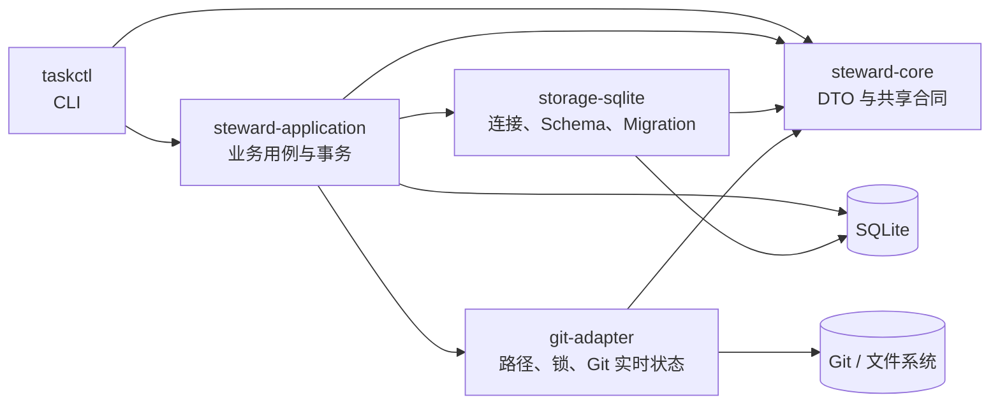

# Agent Steward Code Map

本文件是当前仓库的代码导航入口。它描述已经存在的实现边界、主要调用链、权威数据源和测试位置，不代替 API 文档或产品设计文档。

## 1. 实现状态

- 当前可运行实现是 Cargo workspace 中的 V0 `taskctl`。
- `docs/v0/` 是 V0 历史合同和当前参考实现的行为依据。
- `docs/v1/` 是 Workspace、Repository Registry、Task Review、Daemon、TUI/GUI 和 MCP 等未来产品设计，尚未对应到当前代码模块。
- 阅读代码时不要把 V1 文档中的 `taskd`、`steward-tui`、`steward-gui`、`stewardctl` 或 `steward-mcp` 当作已经存在的组件。

## 2. Workspace 与依赖方向

Workspace 定义位于 [`Cargo.toml`](Cargo.toml)，包含五个 crate：



依赖必须保持从入口和用例层指向合同与基础设施层；`core` 不依赖 Application、SQLite 或 Git。

## 3. Crate 与模块导航

| 区域 | 代码入口 | 主要职责 |
| --- | --- | --- |
| CLI | [`crates/cli/src/main.rs`](crates/cli/src/main.rs) | Clap 命令树、输入读取、危险操作确认、调用 `Service`、JSON envelope、退出码和权限警告 |
| Application 门面 | [`crates/application/src/lib.rs`](crates/application/src/lib.rs) | `Service`、`Outcome`、稳定错误映射、部分外部状态和恢复命令 |
| Task 用例 | [`crates/application/src/tasks.rs`](crates/application/src/tasks.rs) | Task create/show/list/update/note/block/unblock/close/claim/checkpoint |
| Session 用例 | [`crates/application/src/sessions.rs`](crates/application/src/sessions.rs) | Session show/list/attach/close、Task resume、Session Import、History 和 doctor |
| Worktree 用例 | [`crates/application/src/worktrees.rs`](crates/application/src/worktrees.rs) | Worktree status/create/remove/adopt/detach，以及 Git 与 SQLite 的部分完成处理 |
| SQL 映射 | [`crates/application/src/db.rs`](crates/application/src/db.rs) | 常用查询、row 到 DTO 的转换、version 检查、Task version 递增和 History 插入 |
| 核心合同 | [`crates/core/src/lib.rs`](crates/core/src/lib.rs) | Task 状态、输入/输出 DTO、共享校验、按路径分量使用文件系统实际比较语义生成路径键、默认数据目录和跨平台私有权限工具 |
| SQLite 基础设施 | [`crates/storage-sqlite/src/lib.rs`](crates/storage-sqlite/src/lib.rs) | 数据库打开、busy timeout、外键、WAL、Schema v5 Migration、非权威 Worktree 路径键和数据库路径规范化 |
| Git 基础设施 | [`crates/git-adapter/src/lib.rs`](crates/git-adapter/src/lib.rs) | CanonicalPath、含实时 common-dir 关联复核的 Repository identity、任务级 advisory lock、Worktree 命令和实时状态 |

### 实际持久化边界

Application 当前会直接使用 `rusqlite` 编写事务和 SQL；`storage-sqlite` 负责数据库生命周期、Schema 和 Migration，但不是完整的 Repository 抽象层。代码地图应反映这个实际边界，不把设计目标写成现状。

## 4. 权威数据边界

| 事实 | 权威来源 | 读取入口 |
| --- | --- | --- |
| Task、Session、Checkpoint、Note、Import、History | SQLite | Application Service 和 `db.rs` |
| Task version 与当前 Session 引用 | SQLite | `Service::task_*`、`Service::session_*` |
| Repository、Branch、Worktree 的登记引用 | SQLite | Task 的 repository/worktree 字段 |
| HEAD、dirty、staged、unstaged、untracked、ignored | Git 实时状态 | `git_adapter::observe_status` |
| Worktree 路径是否存在、Git 是否仍登记 | 文件系统与 Git | `git_adapter::find_worktree`、`find_worktree_registration`、`observe_status` |
| CLI JSON 合同和稳定错误码 | CLI/Application | `Envelope`、`AppError` |

数据库中的 Worktree 引用不能代替 Git 现场；Git 实时状态也不能自动改写 Task 状态。

## 5. 功能路由

| 能力 | CLI 命令类型 | Application 入口 | 外部依赖 | 主测试 |
| --- | --- | --- | --- | --- |
| Task 生命周期 | `TaskCommand` | `tasks.rs` 中的 `Service::task_*` | SQLite | `v0_flow.rs`、`cli_contract.rs` |
| Session 连续性 | `SessionCommand` | `sessions.rs` 中的 attach/close/resume | SQLite | `v0_flow.rs` |
| Session Import | `ImportCommand` | `session_import_add/list/remove` | 文件系统、SQLite | `v0_flow.rs`、`cli_contract.rs` |
| Worktree 管理 | `WorktreeCommand` | `worktree_create/remove/adopt/detach` | Git、文件系统、SQLite | `v0_flow.rs` |
| History | `TopCommand::History` | `Service::history` | SQLite | `v0_flow.rs` |
| 诊断 | `TopCommand::Doctor` | `Service::doctor` | SQLite、Git、文件系统 | `v0_flow.rs`、`cli_contract.rs` |

CLI 的集中路由位于 `main.rs` 的 `dispatch`。Application 的公开操作统一实现为 `Service` 方法，具体 `impl Service` 分布在 `tasks.rs`、`sessions.rs` 和 `worktrees.rs`。

## 6. 关键调用链

### Task mutation

```text
taskctl 参数
  → CLI dispatch
  → Service::task_*
  → 打开 SQLite 连接并 BEGIN IMMEDIATE
  → 读取 Task + 校验 expected version
  → 更新聚合状态
  → 写入 History
  → 在同一事务中构造响应快照
  → commit
  → CLI envelope
```

### Session resume

```text
task show 取得 version
  → Service::task_resume
  → mutation 前解码最新 Checkpoint
  → 写事务中复核 Task/version/来源 Session
  → 创建全新 Session，并保存 continuedFrom
  → 更新 currentSessionId + History
  → 返回 Task、Checkpoint、Session 列表和实时 Worktree 上下文
```

### Session Import

```text
显式敏感内容确认
  → 规范化并验证普通文件
  → 固定缓冲区有界读取 + SHA-256
  → BEGIN IMMEDIATE
  → Task version 与 Session 归属校验
  → sessionId + sha256 去重
  → 保存 BLOB、递增 Task version、写入 History
  → commit
```

### Worktree mutation

```text
taskctl worktree ...
  → 获取 database + taskId 派生的跨进程 advisory lock
  → 读取 Task 并校验 version/登记引用
  → CanonicalPath + Repository common-dir 身份检查
  → create/remove 执行 Git mutation；adopt/detach 执行恢复前置观察
  → Git mutation 后重观测现场，并在数据库写入前复核目标状态
  → create/adopt 证明目录、Worktree 根、Branch 与 common-dir 一致；remove/detach 证明清除前置条件成立
  → create/adopt 在 BEGIN IMMEDIATE 中实时扫描全部 Worktree Owner；detach 对缺失登记使用规范化精确路径查询 Git
  → 验证通过后执行 SQLite CAS + History
  → 数据库提交后的再次观察
  → success 或 PARTIAL_EXTERNAL_STATE + 显式恢复命令
```

Git 命令不得在 SQLite 写事务中执行。`create/remove/adopt/detach` 持有同一 Task 的 advisory lock，直到数据库结果和后置观察已经分类。

## 7. 核心不变量与高风险区域

- 所有 Task mutation 都使用调用方提供的 expected version；发生 `VERSION_CONFLICT` 后必须重新读取。
- Task mutation 与对应 History 必须在同一事务中提交或回滚。
- Task 的 Repository、common-dir、Branch、Worktree 四个引用必须全有或全空。
- 同一文件系统等价的规范化 Worktree 路径最多由一个 Task 登记；持久化比较键必须逐分量保留其所属父目录的比较语义：现有分量以 canonicalization 和文件系统实际别名解析决定表示，最近现有祖先的探测规则只适用于缺失后缀。不得把末级目录规则应用到整条路径；缺失的非 ASCII 分量处于非精确比较目录时必须拒绝，不能用 Rust Unicode 大小写或规范化近似文件系统。目录规则可原地变化，因此持久化键只是登记时的诊断快照，不建立唯一索引；`create/adopt` 依靠 `BEGIN IMMEDIATE` 串行化，并在写事务内扫描全部现有引用。两条路径都存在时优先比较文件对象身份，规范化目标完全相同时直接判等，路径缺失时才按当前规则比较。恢复建议也必须执行同一 Owner 复核。
- Repository identity 复核不仅验证原 Repository 根和 common-dir 文件对象仍存在且未被替换，还必须重新解析当前 `git rev-parse --git-common-dir` 并证明关联仍指向原 common-dir。
- V0 SQLite/JSON 路径合同只接受 UTF-8；Repository、Worktree 或 Git porcelain 中的路径不能无损表示时必须明确拒绝，禁止使用有损替换字符继续操作。
- Task 当前 Session 必须属于同一 Task 且尚未结束。
- Checkpoint 必须引用同一 Task 的 Session；持久化 JSON 解码失败不能静默转换为空值。
- Session Import 未显式确认敏感内容时，不读取文件、不执行数据库 mutation。
- Worktree 删除拒绝 staged、unstaged、untracked 和 ignored 文件；系统不隐式执行 `push`、`force`、`clean`、`reset` 或 `stash`。
- Worktree 引用只在实时现场满足对应前置条件后写入或清除；`create/adopt` 必须先证明有效 Worktree 身份，`remove/detach` 必须先证明可安全清除。
- Git 与 SQLite 无法原子提交；部分完成必须返回结构化 Git/数据库状态和显式恢复命令。
- 部分完成的恢复命令必须重新读取 Task、使用当前 version，并再次确认 `adopt`/`detach` 前置条件；无法确认时只建议 `doctor`。`detach` 的调用方路径只验证期望值，Git 精确登记查询始终使用数据库登记路径的规范化结果。
- SQLite 是运行时权威来源；不得绕过 Application Service 直接编辑数据库。

修改以下代码时需要优先检查跨层回归：

- `tasks.rs`、`sessions.rs`：Task version、Session 连续性和响应事务快照；
- `worktrees.rs`：Git/SQLite TOCTOU、部分完成分类和恢复命令；
- `storage-sqlite/src/lib.rs`：Migration 原子性、旧数据升级和权限；
- `core/src/lib.rs`：稳定 DTO、跨平台权限和序列化合同；
- `cli/src/main.rs`：JSON schema、退出码、非交互确认和安全警告。

## 8. 测试导航

| 测试位置 | 覆盖范围 |
| --- | --- |
| [`crates/application/tests/v0_flow.rs`](crates/application/tests/v0_flow.rs) | Task/Session/Checkpoint/Import/Worktree 的跨模块业务流程和故障场景 |
| [`crates/cli/tests/cli_contract.rs`](crates/cli/tests/cli_contract.rs) | CLI JSON envelope、退出码、并发启动、敏感内容确认和权限警告 |
| `crates/*/src/lib.rs` 内的 `#[cfg(test)]` | SQLite Migration、Git 路径与锁、Windows ACL、局部错误合同 |

常用验证命令：

```powershell
cargo fmt --all -- --check
cargo clippy --workspace --all-targets -- -D warnings
cargo test --workspace --all-targets
```

## 9. 文档导航

- 仓库与产品入口：[`README.md`](README.md)
- Agent 协作与 `taskctl` 连续性规则：[`AGENTS.md`](AGENTS.md)
- V0 实现合同入口：[`docs/v0/README.md`](docs/v0/README.md)
- V0 CLI 合同：[`docs/v0/03-CLI命令设计.md`](docs/v0/03-CLI命令设计.md)
- V0 数据与存储：[`docs/v0/04-数据模型与存储.md`](docs/v0/04-数据模型与存储.md)
- V0 安全与事务：[`docs/v0/05-安全与事务.md`](docs/v0/05-安全与事务.md)
- V1 设计入口：[`docs/v1/README.md`](docs/v1/README.md)

发生实现与文档差异时，先确认讨论的是 V0 当前实现还是 V1 设计，不跨版本静默推断。

## 10. 地图维护规则

以下变化必须同步更新本文件：

- 新增、删除或重命名 crate、模块、CLI 命令；
- 权威数据源、依赖方向或事务边界发生变化；
- 新增 Git、文件系统、网络或进程等外部副作用；
- 核心调用链、不变量、稳定错误合同或主测试位置发生变化；
- V1 设计开始落地为真实代码模块。

以下变化通常不需要更新：

- 私有辅助函数调整；
- 不改变边界的局部重构；
- 格式化、注释和测试内部整理。

代码地图只记录稳定导航信息。易变的函数签名、私有调用关系和完整 API 应使用 rust-analyzer、`cargo doc` 或源码搜索查看：

```powershell
cargo metadata --no-deps --format-version 1
cargo tree --workspace --depth 1
rg -n "^\s*pub (struct|enum|trait|fn)|^\s*pub fn" crates
cargo test --workspace -- --list
cargo doc --workspace --no-deps --document-private-items
```
