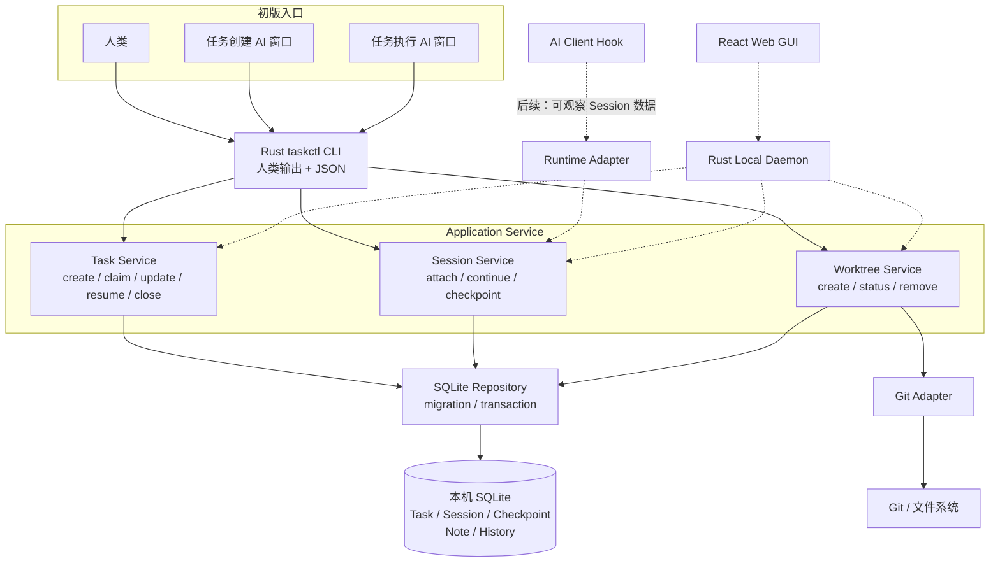
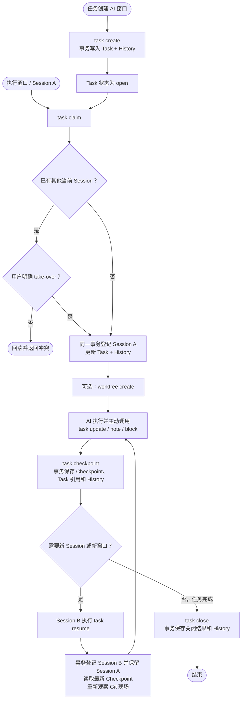
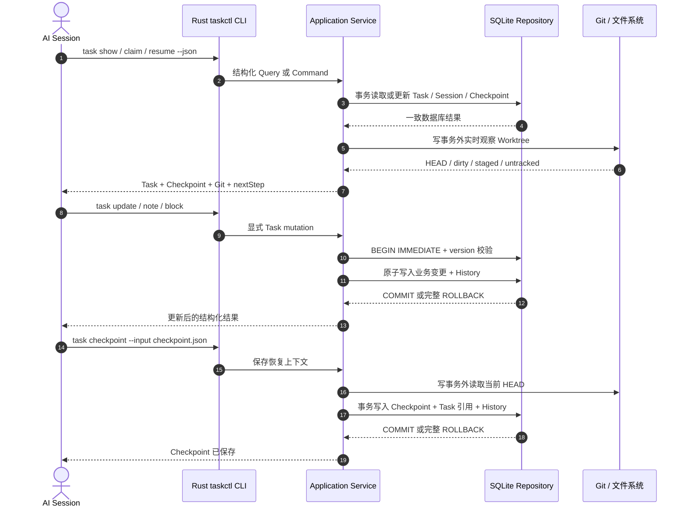
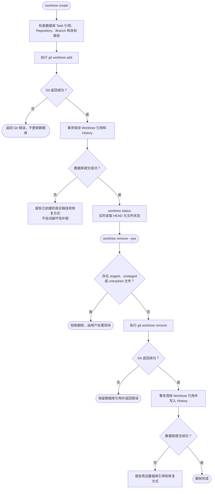
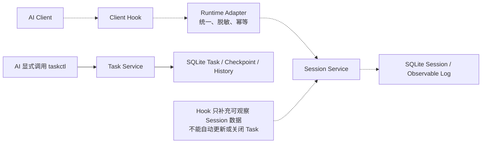

# 架构与流程图

> 当前仓库处于设计阶段，尚无实现代码。实线表示初版范围，虚线表示后续规划。

## 1. 项目理解

`taskctl` 的初版目标是保存任务上下文，让 AI 在不同窗口和 Session 之间继续工作，并提供轻量 Worktree 命令。CLI 使用 Rust 实现；Task、Session、Checkpoint、Note 和 History 保存在本机 SQLite 数据库中；Worktree 现场以 Git 实时观察为准。

## 2. 架构图

SQLite 由 CLI 或后续本地 Daemon 直接访问，不需要独立数据库服务，不支持多台机器共享同一个数据库文件。

## 3. 创建、领取和跨会话继续流程

## 4. AI 在会话中更新数据

## 5. 轻量 Worktree 流程

SQLite 事务不能与 Git 子进程构成同一原子事务。任何部分完成都必须如实返回，不得自动 force、clean、reset、stash 或删除用户现场。

## 6. Hook / Runtime Adapter 后续流程

## 7. 对应文档

- 产品范围：[产品目标与范围](01-产品目标与范围.md)
- Rust 分层与模块：[总体架构](02-总体架构.md)
- CLI 协议：[CLI 命令设计](03-CLI命令设计.md)
- SQLite Schema 与事务：[数据模型与存储](04-数据模型与存储.md)
- Worktree 与数据保护：[安全与事务](05-安全与事务.md)
- Hook / Runtime Adapter：[AI Session 记录](09-AI-Session记录.md)
