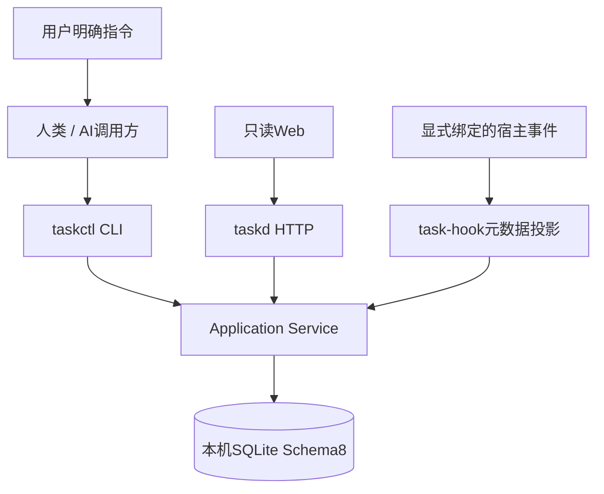
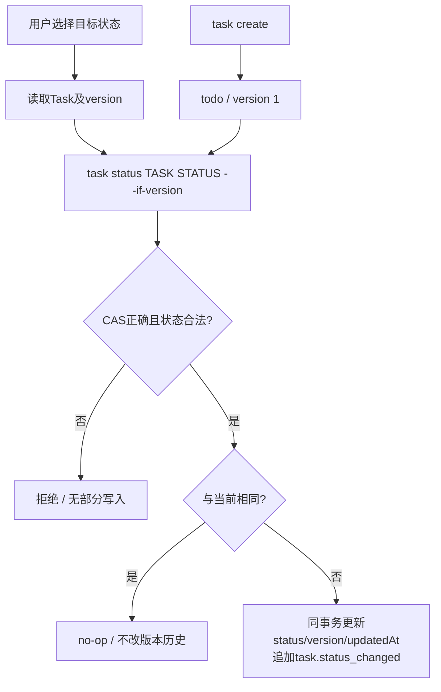
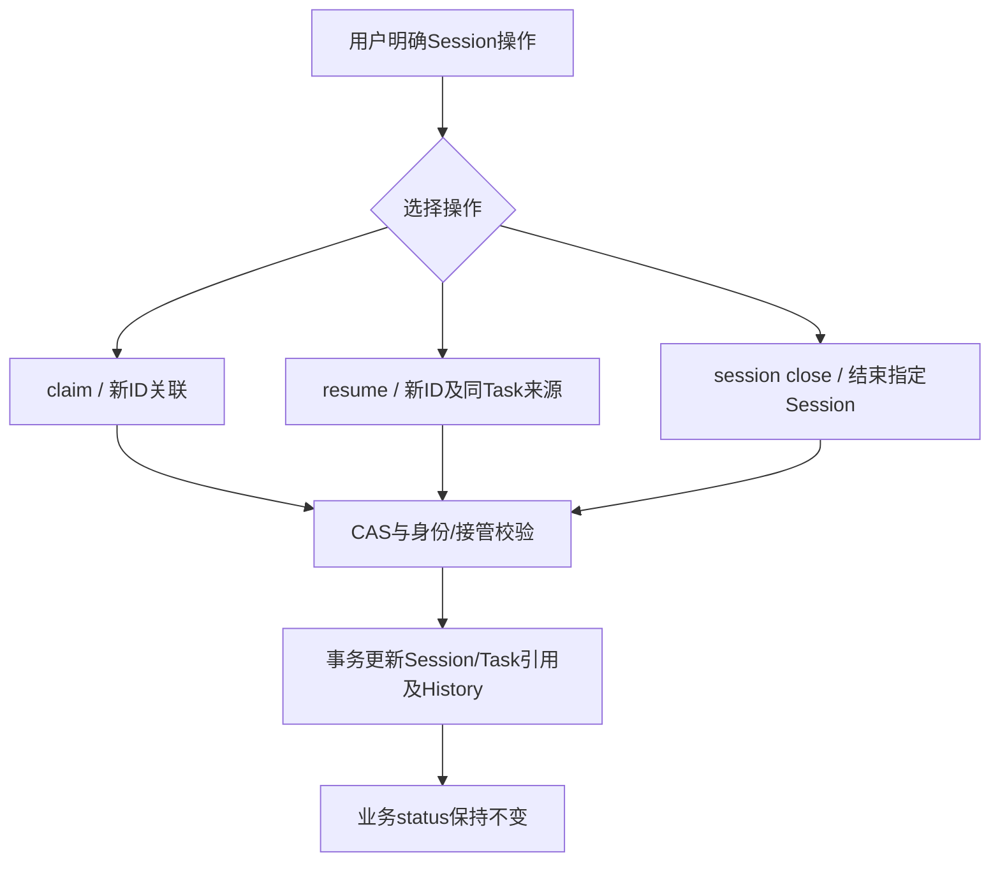
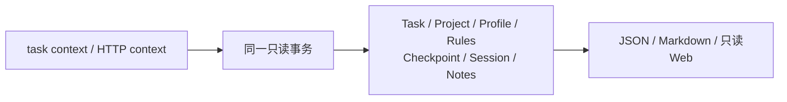

# 架构与流程图

## 数据中心

无Git Adapter、Worktree管理或源码读取。源码路径只是资料；Project/Rule/Task与Session/History存于数据库。V1是独立设计，不从本图推定其实现。

## 业务状态

七状态backlog/todo/in_progress/in_review/blocked/done/cancelled任意转换；没有领取、开发、审核或上线前置条件，不改变Session或清空旧记录。

## Session连续性

status不调用Session操作；Hook不调用status或Session生命周期。历史Session不自动激活；Checkpoint要求同Task未结束的当前Session，但不限制业务状态，不采集Git HEAD。

## 只读上下文与迁移

上下文不建立关联、不读源码或Git。读取WAL可能涉及SHM，但不写业务库。离线迁移只读停写快照，在私有暂存库显式转换和核验，再无覆盖发布新库；不切换服务或恢复Session。

详见 [CLI](03-CLI命令设计.md)、[存储](04-数据模型与存储.md)、[Session](09-AI-Session记录.md)、[迁移](18-Schema7隔离导入与验证.md)。
