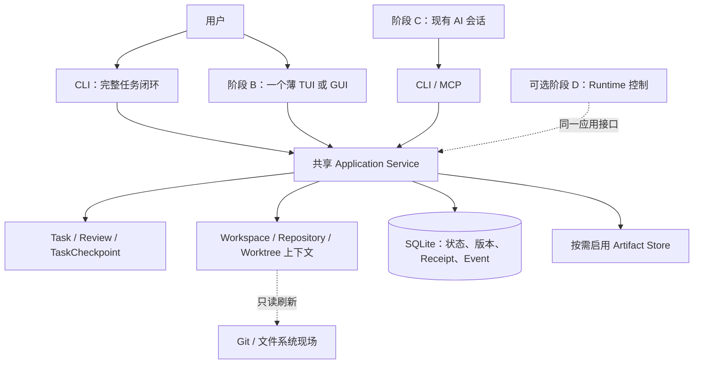

# 总体架构

## 核心边界



阶段 A 从当前目录开始任务，Workspace 可自动建立。最小 Repository/Worktree 身份解析随任务交付，不先构建独立 Registry 产品。阶段 B 增加恢复视图和一个薄界面，阶段 C 接入已有会话；阶段 D 才引入 Runtime 外部副作用。

## 权威与持久化

- SQLite 保存 Task、Review、Checkpoint 引用、上下文关联、版本、幂等记录和对应事件。
- Task 当前状态与用户确认是业务权威；TaskCheckpoint 是版本化的恢复证据，不能覆盖后来发生的变更。
- Git 是当前代码现场的权威。登记的路径、HEAD 和 dirtyState 带观察时间，恢复时重新读取。
- 使用 Artifact Blob 时，SQLite 保存元数据和 Link，文件保存正文；必须遵守发布先于引用和故障恢复协议。
- Markdown 是导出；客户端缓存、会话摘要和衍生索引不成为另一套写入权威。
- 项目约束和决策先采用简单的带来源记录，不要求业务事实图或实现扫描。

## 进程选择

统一 Application Service 是固定要求，常驻 `taskd` 是候选部署形态。D-001/D-019 决定阶段 A 使用本地嵌入式核心还是本地服务；CLI 不实现独立业务规则，也不能自行修改数据库文件绕过核心。

当多客户端实时订阅、受控 AI 连接或后台执行需要服务时，再部署 `taskd`。MCP 必须复用核心的身份、授权、状态机和幂等实现。Domain 不依赖具体 transport、UI 或 Runtime。

```text
core/domain          Task、Review、TaskCheckpoint、Actor、上下文关联
core/application     Command、Query、身份与策略、事务用例
storage/sqlite       状态、Receipt、事件、维护备份
storage/artifact     启用 Blob 时的发布、读取和回收
clients/cli          阶段 A 完整闭环
clients/primary-ui   阶段 B 一个薄界面
transport/local      按进程边界需要启用
integrations/mcp     阶段 C 接入已有会话
extensions/runtime   可选阶段 D
exploration/knowledge 后续探索，不进入首版依赖图
```

## Command 与恢复查询

1. 核心从可信调用上下文派生 principal 和 acting actor，普通参数不得自称用户或扩大 scope。
2. 写入携带幂等键和必要的 expectedVersions；核心规范化请求并计算 requestHash。
3. Receipt 命中时不重复执行，但仍校验当前身份、授权和结果读取权限。
4. 首次请求验证状态机、owner、引用和各对象版本，在同一事务写状态、Receipt 和事件。
5. 恢复查询读取当前 Task、最近 Checkpoint、决策与证据，再读取 Git 现场；两种事实各自标明版本或观察时间，不声称跨 SQLite/Git 原子读取。
6. 使用事件同步时，snapshot 与 eventWatermark 来自同一 SQLite read transaction。cursor 过期强制重取 snapshot；未知事件 schema 不得猜读。

Review 期间修改与撤回、restore generation、Runtime 重试目标解析等未闭合契约见 D-020–D-022。规划调整不等于这些技术问题已经解决。

## 备份与长操作

阶段 A/B 默认采用显式维护模式：停止所有写入与维护 worker，复制一致的数据集，验证后发布备份；恢复先隔离验证，再切换整套数据。启用 Blob 后必须覆盖所保留的 Blob、Link 和密钥恢复材料，不能只复制 SQLite。

在线备份使用第 05 篇的 BackupOperation/Pin/writer gate 协议，仅在停写备份影响实际使用时启用。恢复旧备份需要新的请求与同步 generation，防止旧版本和幂等键重新生效；精确契约在恢复功能编码前冻结。

Artifact 的文件发布从第一次使用 Blob 起就需要可恢复协议。RuntimeOperation 在阶段 D 首次控制外部 Agent 时启用。多 Artifact WorktreeSnapshot、Git executor 和 Optimizer 属于独立后续能力，不能倒逼首版实现全部 operation 模型。
