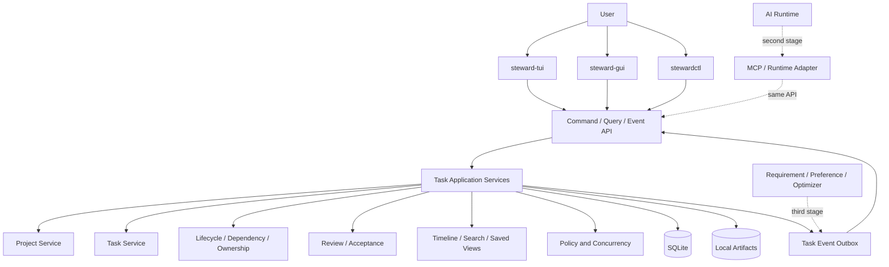

# 总体架构

## 1. 分层架构



详细组件关系见[任务管理器架构图](17-task-manager-architecture.md)，核心状态循环见[任务管理流程图](18-task-management-workflow.md)。

## 2. 权威边界

- **Domain Core**：定义 Task、状态、依赖、ownership、Review 和业务不变量。
- **Application Services**：实现 Command 与 Query，用例只能通过这里改变领域状态。
- **SQLite**：Task 当前状态、关系、版本和 Task Event 的唯一运行时权威。
- **Event Stream**：向 TUI、GUI 和后续扩展发布已提交变化，不独立决定业务状态。
- **Local Artifact Store**：保存附件、交付物和大型内容，SQLite 保存索引、hash 与 provenance。
- **Markdown Export**：只读导出，不接受双向同步，避免双重权威。

AI Runtime、Git 仓库和外部服务各自是其外部事实的权威，但不能绕过 Application Services 直接修改 Task 状态。

## 3. 进程与客户端边界

### `taskd`

本地任务核心，负责：

- Command、Query 和 Event Stream；
- 项目、任务、关系、owner、生命周期和验收规则；
- SQLite migration、事务、版本冲突和备份恢复；
- 搜索索引、保存视图、时间线和事件 outbox；
- 第二阶段的 Actor 权限、AI Assignment 与高风险操作审批。

### `steward-tui` 与 `steward-gui`

- 都是 `taskd` 的客户端，不直接写数据库；
- 可以维护 UI 缓存，但缓存带有 event cursor / entity version；
- 断线后先读取 snapshot，再从 cursor 继续消费事件；
- 高频命令和状态语义必须一致，展示方式可以不同。

### `stewardctl`、`steward-mcp` 与 Runtime Adapter

- CLI 面向脚本和自动化，调用相同 Application Service；
- MCP 与 Runtime Adapter 在第二阶段接入，不实现自己的任务状态机；
- Runtime 只报告运行、阻塞、产物和完成候选，Review 仍由任务核心处理。

## 4. 建议模块边界

```text
core/domain                 Task、Project、Actor、Relation、Review
core/application            Command、Query、事务用例
core/policy                 状态机、并发、权限与高风险门禁
storage/sqlite              schema、migration、repository、outbox
storage/artifact            附件、产物、hash 与恢复
transport/local             本地 RPC、Event Stream
clients/tui                 TUI
clients/gui                 GUI
clients/cli                 自动化 CLI
extensions/ai               MCP、Assignment、Runtime Adapter
extensions/git              Git Plan / Approve / Execute / Verify
extensions/learning         Requirement、Preference、Optimizer
```

依赖方向始终指向内层：客户端和扩展可以依赖 Application/Domain，Domain 不依赖 TUI、GUI、AI Runtime 或 Git 平台。

## 5. Command 写入流程

1. 客户端提交 Command、`actorId`、幂等键和 `expectedVersion`。
2. Application Service 加载 Task aggregate 和相关依赖。
3. Domain 校验状态转换、owner、依赖、验收和策略前置条件。
4. 在同一 SQLite 事务内写入新状态、递增版本并追加 Task Event/outbox。
5. 提交后 Event Stream 通知所有在线客户端。
6. 客户端按事件更新缓存；版本不连续时重新获取 snapshot。

高风险 AI/Git Command 还需要校验 capability、plan 和用户批准，但仍遵守同一事务与事件流程。

## 6. Query 与同步流程

- Query 使用专用 read model 提供 Inbox、Next、Project、Owner、Blocked、Review 和搜索视图。
- read model 可重建，不能成为独立状态权威。
- GUI 与 TUI 首次连接读取 snapshot + cursor；随后消费单调递增的事件序列。
- 客户端离线编辑默认不做静默合并；版本冲突时展示当前值和待应用变更。

## 7. 崩溃与长操作恢复

普通 Task Command 通过单事务保证原子性。第二阶段的 AI、Git 等长操作需要持久化 operation 状态：

```text
planned → approved → executing → verifying → succeeded
                                  ↘ failed
                                  ↘ needs_reconciliation
```

重启后以 SQLite、Artifact、Git 和 Runtime 的可验证事实恢复，不能仅依赖聊天摘要或执行者声明。
