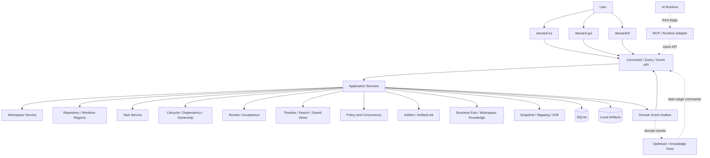
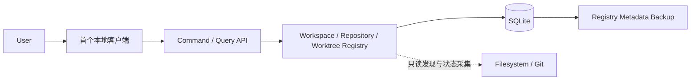

# 总体架构

## 1. 分层架构



详细组件关系见[任务管理器架构图](17-task-manager-architecture.md)，核心状态循环见[任务管理流程图](18-task-management-workflow.md)。

### 第一阶段实现边界



第一阶段只交付 Workspace、Repository 和 Worktree 的登记、查询、只读发现、状态刷新、解除关联及元数据备份恢复。Task、Artifact、Review、AI Runtime、知识模型和 Git 写操作不进入该阶段，避免基础上下文尚未稳定时并行建立第二套业务主线。

## 2. 权威边界

- **Domain Core**：定义 Workspace、Repository、Worktree、Task、BusinessFact、Artifact、Mapping 等 aggregate、关系和业务不变量。
- **Application Services**：实现 Command 与 Query，用例只能通过这里改变领域状态。
- **SQLite**：aggregate 当前状态、ArtifactLink 等关系、CommandReceipt、ArtifactFinalizeIntent、CaptureOperation、BackupOperation/Pin、RuntimeOperation、版本和 DomainEvent envelope 的唯一运行时权威。
- **Event Stream**：向 TUI、GUI 和后续扩展发布已提交变化，不独立决定业务状态。
- **Local Artifact Store**：保存附件、交付物、FactRevision/Wiki 正文和快照证据等大型内容；SQLite 保存 Artifact 元数据、hash、provenance 与通用 ArtifactLink，不要求 Artifact 归属 Task。文件系统不加入 SQLite transaction，使用 durable finalize intent、原子 Blob 发布和 finalize transaction；GC 先把独占 Blob 的 Artifact 原子 claim 为 deleting，再删除文件。
- **Markdown Export**：只读导出，不接受双向同步，避免双重权威。

AI Runtime、Git 仓库和外部服务各自是其外部事实的权威，但不能绕过 Application Services 直接修改任何领域 aggregate。

restore 是唯一必须跨越 SQLite data-root replacement 的本地控制操作；其最小 bootstrap journal 位于 old/new data root 之外，只负责 restore 幂等键、manifest hash、generation pointer 和切换阶段，不承载普通领域状态。所有 SQLite writer 共用数据库层 writer gate，backup 固定 manifest 到 online backup 完成期间，Application Command、Artifact/Runtime recovery、lease、event retention、GC、migration 和维护 worker 都不能绕过该 gate。

## 3. 进程与客户端边界

### `taskd`

本地任务核心，负责：

- Command、Query 和 Event Stream；
- Workspace/Repository/Worktree Registry，以及后续 Task、业务事实、关系、owner、生命周期和验收规则；
- SQLite migration、事务、版本冲突和备份恢复；
- 搜索索引、保存视图、时间线和事件 outbox；
- 第三阶段的 Actor 权限、AI Assignment、RuntimeOperation/reconcile 与高风险操作审批。

### `steward-tui` 与 `steward-gui`

- 都是 `taskd` 的客户端，不直接写数据库；
- 可以维护 UI 缓存，但缓存带有全局 event streamPosition / entity version；
- 断线后通过同一个 SQLite read transaction 获取 snapshot + eventWatermark，再消费 `streamPosition > eventWatermark` 的事件；
- 高频命令和状态语义必须一致，展示方式可以不同。

### `stewardctl`、`steward-mcp` 与 Runtime Adapter

- CLI 面向脚本和自动化，调用相同 Application Service；
- MCP 与 Runtime Adapter 在第三阶段接入，不实现自己的任务状态机；
- Runtime 只报告运行、阻塞、产物和完成候选，Review 仍由任务核心处理。

## 4. 建议模块边界

```text
core/domain                 Workspace、Repository、Worktree、Task、Fact、Artifact、Actor、Relation、Review
core/application            Command、Query、事务用例
core/policy                 状态机、并发、权限与高风险门禁
storage/sqlite              schema、migration、repository、receipt/intent/operation、outbox
storage/artifact            独占 Blob staging/publish、加密、hash、恢复与 deleting GC
transport/local             本地 RPC、Event Stream
clients/tui                 TUI
clients/gui                 GUI
clients/cli                 自动化 CLI
extensions/ai               MCP、Assignment、Runtime Adapter
extensions/git              Git Plan / Approve / Execute / Verify
knowledge/workspace         Business System、Scenario、Fact Revision（Phase 4）
extensions/code-intel       Snapshot、Mapping、Drift Finding
extensions/learning         Preference、Feedback、Optimizer
```

依赖方向始终指向内层：客户端和扩展可以依赖 Application/Domain，Domain 不依赖 TUI、GUI、AI Runtime 或 Git 平台。

## 5. Command 写入流程

1. 可信 transport 根据认证连接得到 `principalId`，由 taskd 映射并派生 `actingActorId`。
2. 客户端提交 target aggregate type/id、Command payload、幂等键，以及更新既有可变 aggregate 时的 `expectedVersion`；跨 aggregate Command 分别提交每个可变对象的前置版本，不得提交或覆盖 acting actor。
3. taskd 规范化语义请求并计算 requestHash，查询同一 principal/command type/idempotency key 的 Receipt；hash 不同立即返回 IDEMPOTENCY_KEY_REUSED，hash 相同只阻止重复执行，不能立即返回敏感历史结果。
4. 无论 Receipt 是否命中，taskd 都重新校验当前 connection、grant，以及 target/resultRef 对象的读取权限。命中且仍有权时返回原结果；授权已撤销或缩小时返回 FORBIDDEN_SCOPE 或不含 payload/resultRef 的脱敏终态，不重新执行副作用。
5. Assignment、owner 等命令可以包含 `targetActorId`，但它只表示操作目标，并需要单独授权。
6. Application Service 加载 target aggregate、命令涉及的其他 aggregate 和必要关系。
7. Domain 校验 aggregate 不变量、版本、acting actor、授权、引用完整性和策略前置条件。
8. 在同一 SQLite 事务内写入新状态、CommandReceipt、递增版本，并以服务端派生的 principal/actor 写入带 streamPosition/schemaVersion/requestHash 的 DomainEvent/outbox envelope。
9. 提交后 Event Stream 通知所有在线客户端。
10. 客户端按事件更新缓存；aggregateVersion 不连续时重新获取 snapshot。

Task Command 另外校验 lifecycle、active TaskOwnership/owner epoch、依赖和验收规则；高风险 AI/Git Command 还需要校验 capability、plan 和用户批准。包含单个新 Blob 的 Command 使用 durable ArtifactFinalizeIntent；WorktreeSnapshot 的多 Blob 发布使用固定完整清单的 CaptureOperation，并在单一 SQLite transaction 中原子 promotion。Runtime 外部副作用使用 RuntimeOperation，在调用前持久化 operationId/requestHash，结果未知时 reconcile 而非盲目重试。具体恢复协议见领域模型与 Runtime Adapter 文档。

审计同时记录 principal 和 acting actor。客户端提供的显示名、Session metadata 或普通 Command 字段不能成为审计身份。

## 6. Query 与同步流程

- Query 使用按目标领域划分的 read model：Phase 1 提供 Workspace、Repository、Worktree 与 availability/dirty 状态；Task 提供 Inbox、Next、Repository/Worktree context、Owner、Blocked 与 Review；后续 Fact/Mapping 提供业务事实、snapshot context、freshness 和 drift 视图。
- read model 可重建，不能成为独立状态权威。
- Snapshot Query 在同一个 SQLite read transaction 中读取 read model 与当前全局 eventWatermark，并以一个响应返回；客户端只消费 `streamPosition > eventWatermark` 的 DomainEvent。snapshot 与 watermark 不允许通过两个独立请求拼接。
- 全局 streamPosition 与 aggregateVersion 分离、单调递增且允许空洞。客户端 cursor 早于 outbox 的 earliestAvailablePosition 时，服务端返回 `CURSOR_EXPIRED` 并强制重新获取 snapshot + watermark，不能从仍保留的较新事件静默续传。
- ArtifactBlobPending 是 internal/audit-only 存储记录，没有业务 streamPosition，也不进入 TUI/GUI Event Stream；只有 Artifact finalized 且 active Link 在同一事务建立后，相关业务 DomainEvent 才能按目标 aggregate scope 投递。
- 客户端离线编辑默认不做静默合并；版本冲突时展示当前值和待应用变更。

## 7. 崩溃与长操作恢复

普通 Registry/Task Command 通过单事务保证原子性。第三阶段的 AI 以及后续 Git 写操作等长操作需要持久化 operation 状态：

```text
planned → approved → executing → verifying → succeeded
                                  ↘ failed
                                  ↘ needs_reconciliation
```

重启后以 SQLite、Artifact、Git 和 Runtime 的可验证事实恢复，不能仅依赖聊天摘要或执行者声明。
