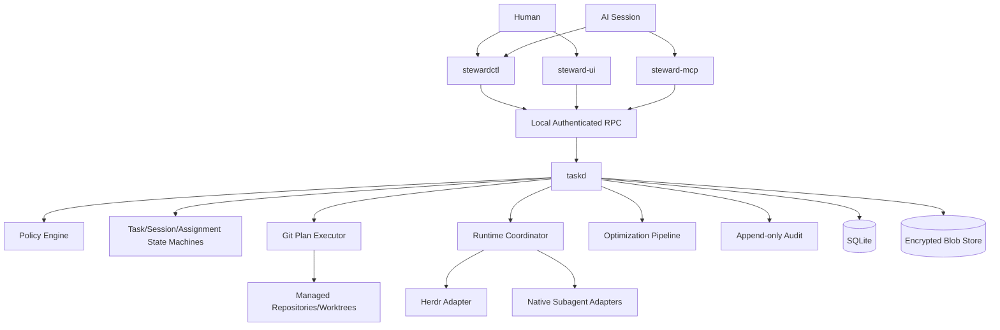

# 总体架构

## 1. 逻辑架构



## 2. 进程边界

### taskd

可信常驻服务，负责：

- 身份、grant、lease、epoch 和 capability；
- 任务、Assignment 和 Session 状态机；
- SQLite 与 Blob Store 唯一写入；
- Git 计划及执行；
- Runtime 调度；
- 审计和崩溃恢复；
- 用户审批验证。

### stewardctl

无特权客户端：

- 人类可以在可信终端获得 Human/Admin principal；
- Agent 调用时只继承 Agent Session capability；
- 所有写入仍通过 taskd；
- 不直接修改 SQLite、审计日志或 Git 凭据。

### steward-mcp

MCP 薄适配层：

- 将 MCP connection 绑定到 Session/Grant；
- 将结构化工具请求映射到同一 Application Service；
- 不自行实现状态机或权限；
- 工具隐藏仅用于减少误用，服务端授权才是安全边界。

### Runtime Adapter

连接外部 Agent 宿主，仅负责运行时动作和事实采集，不拥有任务状态权威。

## 3. 数据边界

- SQLite：任务、角色、状态、索引、事件、计划和元数据权威。
- Blob Store：完整 Session、Prompt、工具输出、报告和附件。
- Audit Log：append-only 安全轨迹，可使用 hash chain 检测篡改。
- Markdown：按需导出的阅读材料，不接受双向写入。
- Git：源码、提交、分支和 tree 的事实权威。
- Herdr/Native Runtime：运行进程和可用能力的事实来源。

## 4. 核心模块

```text
core/domain
core/application
core/policy
core/audit
storage/sqlite
storage/blob
transport/local-rpc
transport/mcp
cli
approval-ui
runtime-sdk
runtime-herdr
runtime-native-*
git-executor
optimizer
```

## 5. 请求处理流程

所有写请求统一执行：

1. 识别 connection principal。
2. 校验 grant、scope、lease 和 owner epoch。
3. 读取实体 currentVersion。
4. 校验状态机前置条件。
5. 校验请求的 `expectedVersion` 和幂等键。
6. 对高风险操作检查 plan 和用户批准。
7. 在事务内写入状态及 outbox event。
8. 记录不可变审计事实。
9. 返回新版本和结构化结果。

## 6. 崩溃恢复

长操作需要持久化 operation 状态：

```text
planned → approved → executing → verifying → succeeded
                                  ↘ failed
                                  ↘ needs_reconciliation
```

重启后不能只按聊天摘要重放。服务必须读取 SQLite、Git、Runtime 和 operation 事实，再决定是否继续、失败或要求人工协调。
