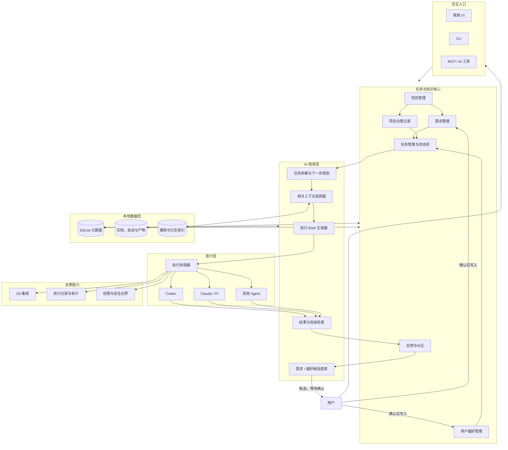

# 产品架构图

本图将 Agent Steward 的产品中心定义为任务、项目需求、用户偏好、上下文组装和反馈学习。Git、安全与多 Agent 编排是支撑能力，不主导产品结构。

```mermaid
flowchart TB
    User[用户]

    subgraph Access[交互入口]
        UI[桌面 UI]
        CLI[CLI]
        MCP[MCP / AI 工具]
    end

    subgraph Core[任务与知识核心]
        PM[项目管理]
        RM[需求管理]
        Pref[用户偏好管理]
        Decision[项目决策记录]
        Task[任务管理与状态机]
        Feedback[反馈与纠正]
    end

    subgraph Intelligence[AI 效率层]
        Selector[相关上下文选择器]
        Brief[执行 Brief 生成器]
        Planner[任务拆解与下一步规划]
        Evaluator[结果与验收检查]
        Learner[需求 / 偏好候选提炼]
    end

    subgraph Runtime[执行层]
        Orchestrator[执行协调器]
        Codex[Codex]
        Claude[Claude / Pi]
        Other[其他 Agent]
    end

    subgraph Storage[本地数据层]
        DB[(SQLite 元数据)]
        Blob[(文档、会话与产物)]
        Index[(搜索与衍生索引)]
    end

    subgraph Support[支撑能力]
        Git[Git 集成]
        Audit[执行记录与审计]
        Permission[权限与安全边界]
    end

    User --> Access
    Access --> Core

    PM --> RM
    PM --> Decision
    RM --> Task
    Pref --> Task
    Decision --> Task

    Task --> Planner
    Planner --> Selector
    Selector --> Brief
    Brief --> Orchestrator

    Orchestrator --> Codex
    Orchestrator --> Claude
    Orchestrator --> Other

    Codex --> Evaluator
    Claude --> Evaluator
    Other --> Evaluator

    Evaluator --> Feedback
    Feedback --> Learner
    Learner -->|候选，等待确认| User
    User -->|确认后写入| RM
    User -->|确认后写入| Pref

    Core <--> DB
    Intelligence <--> DB
    Core <--> Blob
    Selector <--> Index

    Orchestrator --> Git
    Orchestrator --> Audit
    Orchestrator --> Permission
```
