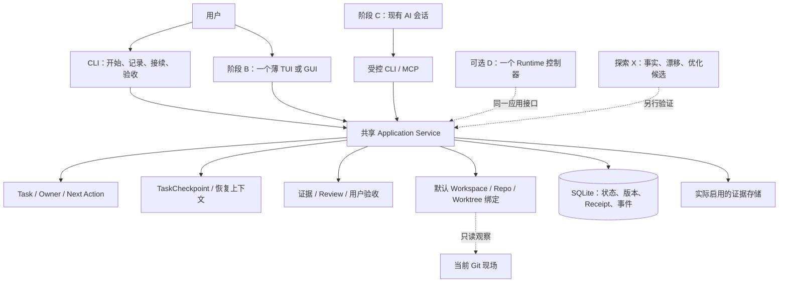

# 产品架构图

当前主线为阶段 A–C。Workspace/Git 服务于任务接续；Runtime 控制为可选 D，知识与优化为探索 X，不在主链路上。

```mermaid
flowchart TB
  User[用户] --> CLI[CLI：开始、记录、接续、验收]
  User --> UI[阶段 B：一个薄 TUI 或 GUI]
  Session[阶段 C：现有 AI 会话] --> Bridge[受控 CLI / MCP]
  CLI --> Core[共享 Application Service]
  UI --> Core
  Bridge --> Core
  Core --> Task[Task / Owner / Next Action]
  Core --> Checkpoint[TaskCheckpoint / 恢复上下文]
  Core --> Review[证据 / Review / 用户验收]
  Core --> Context[默认 Workspace / Repo / Worktree 绑定]
  Context -.只读观察.-> Git[当前 Git 现场]
  Core --> DB[(SQLite：状态、版本、Receipt、事件)]
  Core --> Store[实际启用的证据存储]
  Runtime[可选 D：一个 Runtime 控制器] -.同一应用接口.-> Core
  Knowledge[探索 X：事实、漂移、优化候选] -.另行验证.-> Core
```

统一核心不等于必须常驻 taskd。先按客户端与并发需求选择部署形态；第二客户端、后台 worker、全量会话库不属于首版架构前提。
