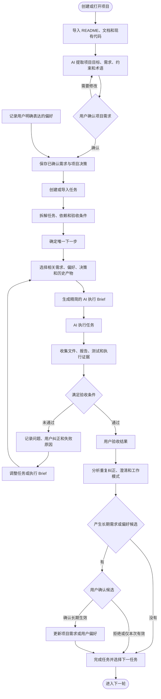

# 核心业务流程图

本流程描述 AI 与学习能力全部启用后的完整闭环，不代表首个版本的实现顺序。第一阶段的纯任务循环见[任务管理流程图](18-task-management-workflow.md)。

```mermaid
flowchart TB
    Start([创建或打开项目])

    Import[导入 README、文档和现有代码]
    Extract[AI 提取项目目标、需求、约束和术语]
    ConfirmReq{用户确认项目需求}
    SaveReq[保存已确认需求与项目决策]

    CapturePref[记录用户明确表达的偏好]
    CreateTask[创建或导入任务]
    Decompose[拆解任务、依赖和验收条件]
    Next[确定唯一下一步]

    SelectContext[选择相关需求、偏好、决策和历史产物]
    BuildBrief[生成精简的 AI 执行 Brief]
    Execute[AI 执行任务]
    Collect[收集文件、报告、测试和执行证据]

    Evaluate{满足验收条件}
    Feedback[记录问题、用户纠正和失败原因]
    Retry[调整任务或执行 Brief]

    Accept[用户验收结果]
    Learn[分析重复纠正、澄清和工作模式]
    Candidate{产生长期需求或偏好候选}
    ConfirmLearning{用户确认候选}
    UpdateMemory[更新项目需求或用户偏好]
    Complete[完成任务并选择下一任务]
    End([进入下一轮])

    Start --> Import
    Import --> Extract
    Extract --> ConfirmReq

    ConfirmReq -->|需要修改| Extract
    ConfirmReq -->|确认| SaveReq

    CapturePref --> SaveReq
    SaveReq --> CreateTask
    CreateTask --> Decompose
    Decompose --> Next

    Next --> SelectContext
    SelectContext --> BuildBrief
    BuildBrief --> Execute
    Execute --> Collect
    Collect --> Evaluate

    Evaluate -->|未通过| Feedback
    Feedback --> Retry
    Retry --> SelectContext

    Evaluate -->|通过| Accept
    Accept --> Learn
    Learn --> Candidate

    Candidate -->|没有| Complete
    Candidate -->|有| ConfirmLearning

    ConfirmLearning -->|拒绝或仅本次有效| Complete
    ConfirmLearning -->|确认长期生效| UpdateMemory
    UpdateMemory --> Complete

    Complete --> End
```
