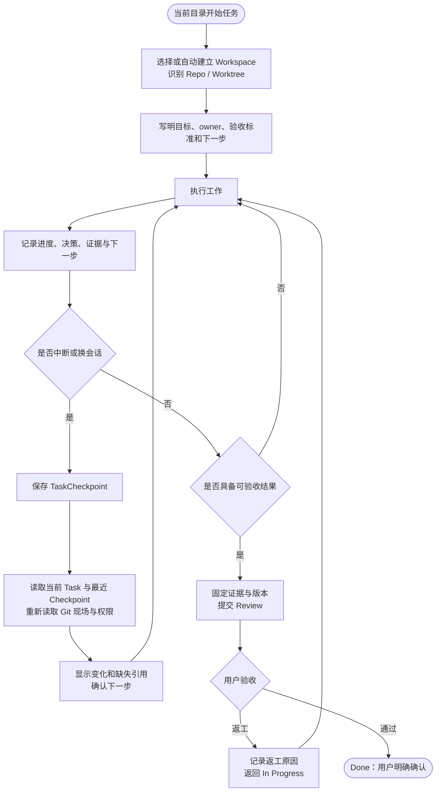

# 核心工作流

从当前目录的实际任务开始；无需先完成 Workspace onboarding，不要求 AI 或知识提取。

```mermaid
flowchart TB
  Start([当前目录开始任务]) --> Context[选择或自动建立 Workspace<br/>识别 Repo / Worktree]
  Context --> Task[写明目标、owner、验收标准和下一步]
  Task --> Work[执行工作]
  Work --> Record[记录进度、决策、证据与下一步]
  Record --> Pause{是否中断或换会话}
  Pause -->|是| Save[保存 TaskCheckpoint]
  Save --> Resume[读取当前 Task 与最近 Checkpoint<br/>重新读取 Git 现场与权限]
  Resume --> Diff[显示变化和缺失引用<br/>确认下一步]
  Diff --> Work
  Pause -->|否| Ready{是否具备可验收结果}
  Ready -->|否| Work
  Ready -->|是| Submit[固定证据与版本<br/>提交 Review]
  Submit --> Human{用户验收}
  Human -->|返工| Changes[记录返工原因<br/>返回 In Progress]
  Changes --> Work
  Human -->|通过| Done([Done：用户明确确认])
```

阶段 C 的新 AI 会话接入 Resume 节点，读取同一任务而不创建副本；交接不要求产品启动 Agent。优化候选、知识提取和 Git 合并均不作为 Done 的前置条件。
