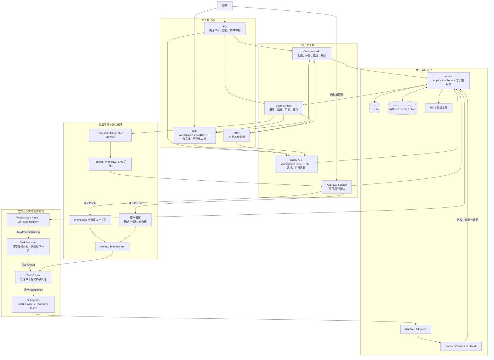

# TUI 与 GUI 交互架构图

TUI 和 GUI 是同一 taskd 的两个一等客户端。二者共享命令契约、查询模型、事件流和权限判定，不维护彼此独立的业务状态。本图包含后续 Task、AI 和优化入口；Phase 1 先交付 Workspace/Repo onboarding 与概览，任务核心边界见[任务管理器架构图](17-task-manager-architecture.md)。

## 交互原则

- TUI 和 GUI 只负责呈现与发出命令，`taskd` 是唯一业务状态权威。
- 所有关键能力在两个客户端中语义一致；GUI 可以提供更丰富的看板、对比和审批体验。
- 在任一客户端完成操作后，另一客户端通过 Event Stream 实时更新。
- 客户端断线重连时，先通过 Query API 重建快照，再从事件游标继续消费。
- Context & Optimization Steward 位于任务交付循环之外，只能生成候选；长期需求、偏好和 Prompt 变更必须由用户确认。
