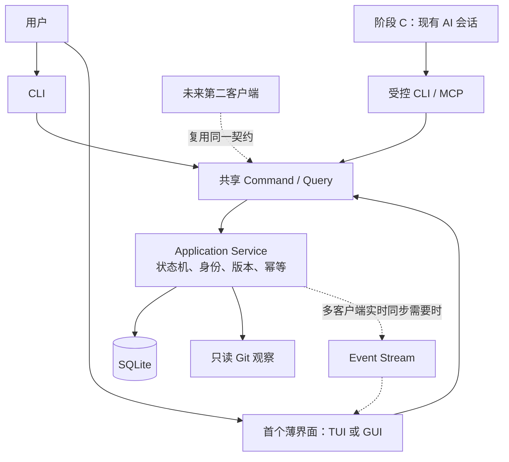

# 客户端交互架构

CLI 先覆盖完整闭环；阶段 B 选择一个薄 TUI 或 GUI。第二客户端仅在有明确需求时补齐，不能成为首版验收门槛。

- CLI 提供完整创建、进度、Checkpoint、恢复、Review 与归档路径。
- 首个薄界面优先展示当前任务、最近恢复记录、证据与用户验收，不追求复杂看板。
- 任何 UI 都不能直接修改数据库或另写一套业务规则。
- 部署为服务时通过本地 transport 调用核心；是否常驻由 D-019 决定。
- 使用事件流时，snapshot 与 watermark 同事务，过期 cursor 重建；restore generation 规则在 D-021 冻结。
- 用户验收入口与 AI 完成候选写入明确区分；同身份 Standard 不宣称对抗性隔离。
