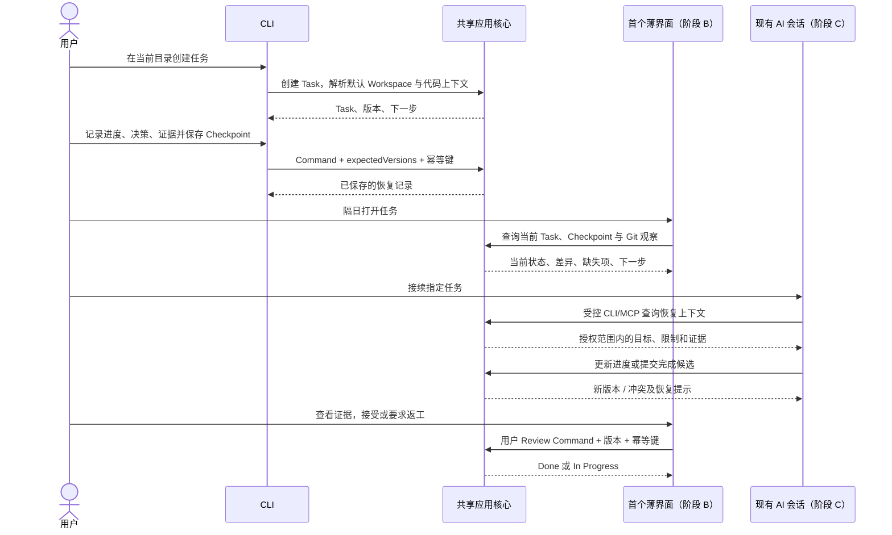

# 客户端协作与换会话流程

CLI 是首个完整入口，阶段 B 的薄界面辅助浏览和验收。下图的 AI 是用户已有会话，产品不负责启动、关闭或压缩它。

```mermaid
sequenceDiagram
  actor User as 用户
  participant CLI as CLI
  participant Core as 共享应用核心
  participant UI as 首个薄界面（阶段 B）
  participant AI as 现有 AI 会话（阶段 C）
  User->>CLI: 在当前目录创建任务
  CLI->>Core: 创建 Task，解析默认 Workspace 与代码上下文
  Core-->>CLI: Task、版本、下一步
  User->>CLI: 记录进度、决策、证据并保存 Checkpoint
  CLI->>Core: Command + expectedVersions + 幂等键
  Core-->>CLI: 已保存的恢复记录
  User->>UI: 隔日打开任务
  UI->>Core: 查询当前 Task、Checkpoint 与 Git 观察
  Core-->>UI: 当前状态、差异、缺失项、下一步
  User->>AI: 接续指定任务
  AI->>Core: 受控 CLI/MCP 查询恢复上下文
  Core-->>AI: 授权范围内的目标、限制和证据
  AI->>Core: 更新进度或提交完成候选
  Core-->>AI: 新版本 / 冲突及恢复提示
  User->>UI: 查看证据，接受或要求返工
  UI->>Core: 用户 Review Command + 版本 + 幂等键
  Core-->>UI: Done 或 In Progress
```

阶段 A 可以全部经 CLI 完成。AI 和 UI 的加入复用既有流程，不改变状态权威；保存 Checkpoint 或会话结束不会自动关闭任务。
