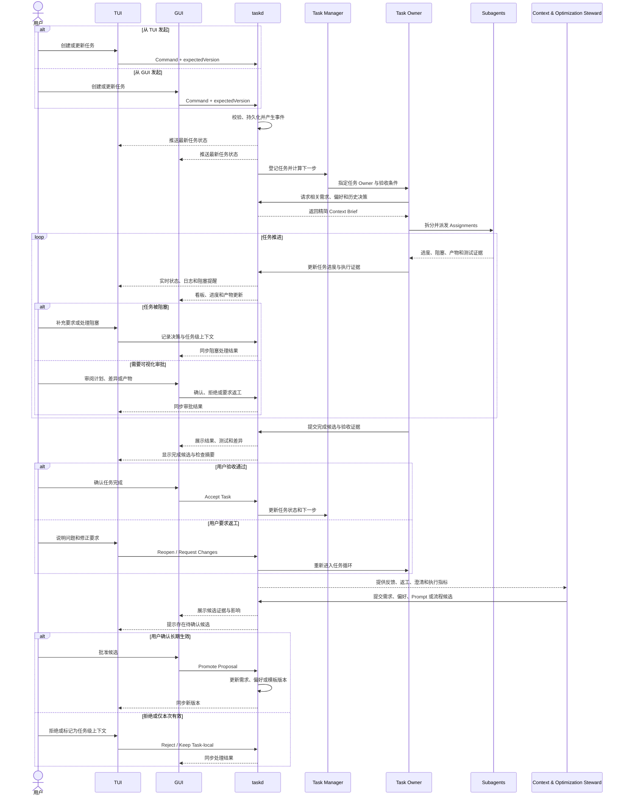

# TUI 与 GUI 协同交互流程图

本图以“从任一客户端创建任务，在另一客户端观察或审批”为例，展示 TUI、GUI、任务角色和外层优化角色如何通过同一状态权威协同。

## 推荐的客户端分工

| 场景 | TUI | GUI |
|---|---|---|
| 快速创建、查询和推进任务 | 主入口 | 支持 |
| 执行日志和实时状态 | 流式查看 | 聚合查看 |
| 任务看板和依赖关系 | 简化列表 | 主入口 |
| 项目需求与偏好维护 | 快速编辑 | 主入口 |
| 计划、差异和产物审批 | 可信终端确认 | 可视化主入口 |
| 优化候选审阅 | 摘要与命令 | 证据、对比和影响分析 |
