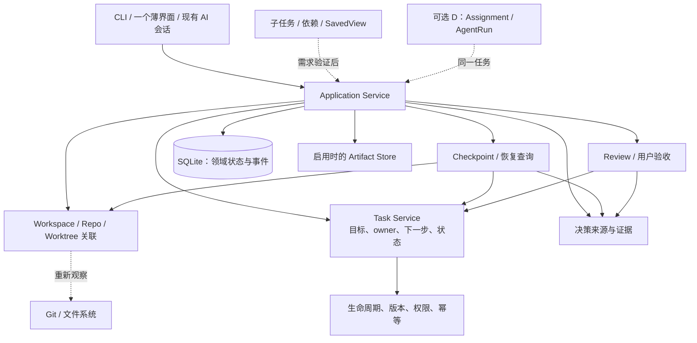

# 任务接续核心架构

阶段 A–C 的最小核心以 Task 和 TaskCheckpoint 为中心。Task Manager 是用户管理任务时承担的角色，不要求独立的自动调度器。

- Checkpoint 引用采集时的 Task 版本，不独立维护 lifecycle 或 owner。
- 恢复上下文展示当前事实与历史声明的差异，不能把摘要当作当前现场。
- Review 固定证据，由用户验收；owner 可以是人或 AI，但执行声明不能代替验收。
- 首期不要求 Next Action Engine、复杂依赖图或第二客户端；下一步可由当前 owner 明确维护。
