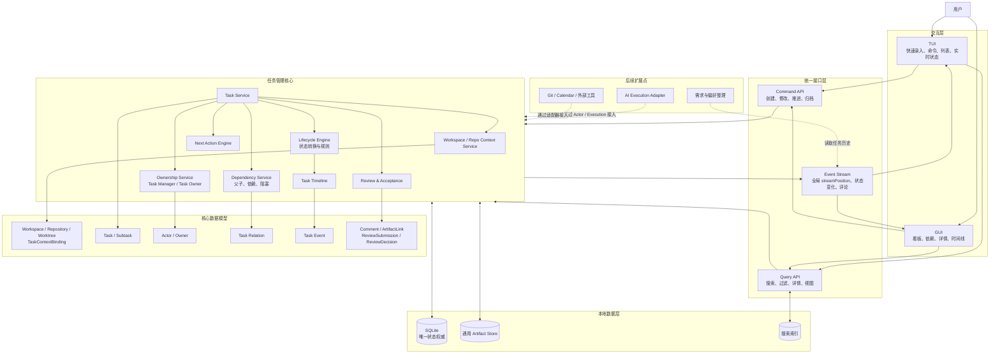

# 任务管理器架构图

本图描述 Phase 2 的任务与 Review 闭环，并假设 Phase 1 已提供 Workspace、Repository 和 Worktree Registry。TUI 与 GUI 是同一任务核心的两个客户端；AI、业务事实和流程优化仅作为后续扩展点。

## 架构原则

- TUI 和 GUI 不维护独立业务状态。
- 所有写入使用同一 Command API，所有查询来自同一 SQLite 权威数据源。
- 任一客户端修改后，另一客户端从同事务 snapshot + eventWatermark 继续通过全局 streamPosition 同步。
- Task 是 Phase 2 的核心工作实体，必须归属 Workspace，并可通过 TaskContextBinding 关联 Repo/Worktree；AI 后续通过通用 Actor、Execution 和 Adapter 接入。
- 业务事实、偏好和流程优化读取任务历史，但不进入 Phase 2 的任务写入主链路。
