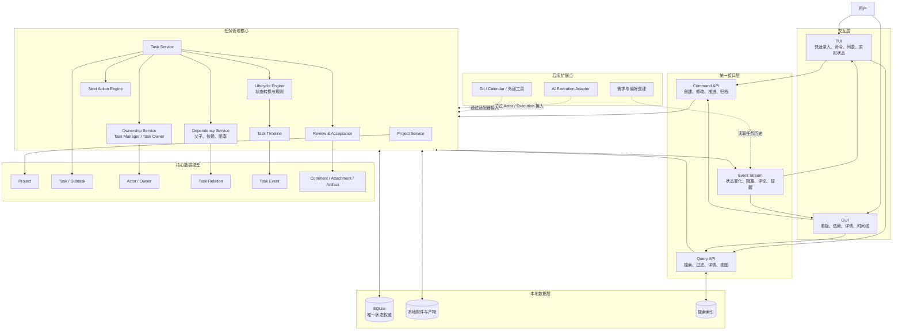

# 任务管理器架构图

本图只描述第一优先级的任务管理器。TUI 与 GUI 是同一任务核心的两个客户端；AI、需求整理和流程优化仅作为后续扩展点。

## 架构原则

- TUI 和 GUI 不维护独立业务状态。
- 所有写入使用同一 Command API，所有查询来自同一 SQLite 权威数据源。
- 任一客户端修改后，另一客户端通过 Event Stream 同步。
- Task 是第一等核心实体；AI 后续通过通用 Actor、Execution 和 Adapter 接入。
- 需求、偏好和流程优化读取任务历史，但不进入第一阶段的任务写入主链路。
