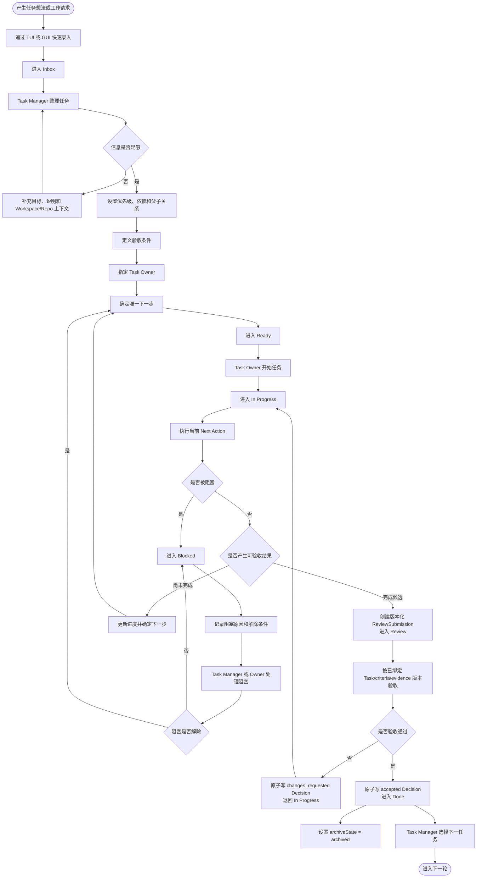

# 任务管理流程图

本流程描述 Phase 2 的任务生命周期，假设 Phase 1 已建立 Workspace/Repository/Worktree Registry。任务必须归属 Workspace，但不要求 Project；该流程不依赖 AI 才能成立。



## 默认状态

```text
Inbox → Ready → In Progress → Blocked → Review → Done
```

`Cancelled` 是业务终态。归档是与生命周期正交的收纳属性：它设置 `archiveState=archived` 和 archivedAt，但保留 Done、Cancelled 等原 status；恢复归档后仍从保留的 status 继续。AI 执行者未来也必须遵循同一 Task 生命周期，不能建立另一套 AI 专用任务状态。

每次进入 Review 都使用新的 reviewCycle；submit 为每个 source evidence 创建由 ReviewSubmission 独立持有的 active `review_evidence` Link，并固定 submittedTaskVersion、acceptanceCriteriaHash 和 evidence set。accept/request-changes 同时校验 Task 与 Submission 版本；accept 另外校验 submission-owned Link/version/contentHash，request-changes 可把证据缺失作为返工理由。两者都在同一事务写 Decision 和状态转换；Done 重新打开固定回到 In Progress，历史 accepted Decision 不得用于再次完成任务。
