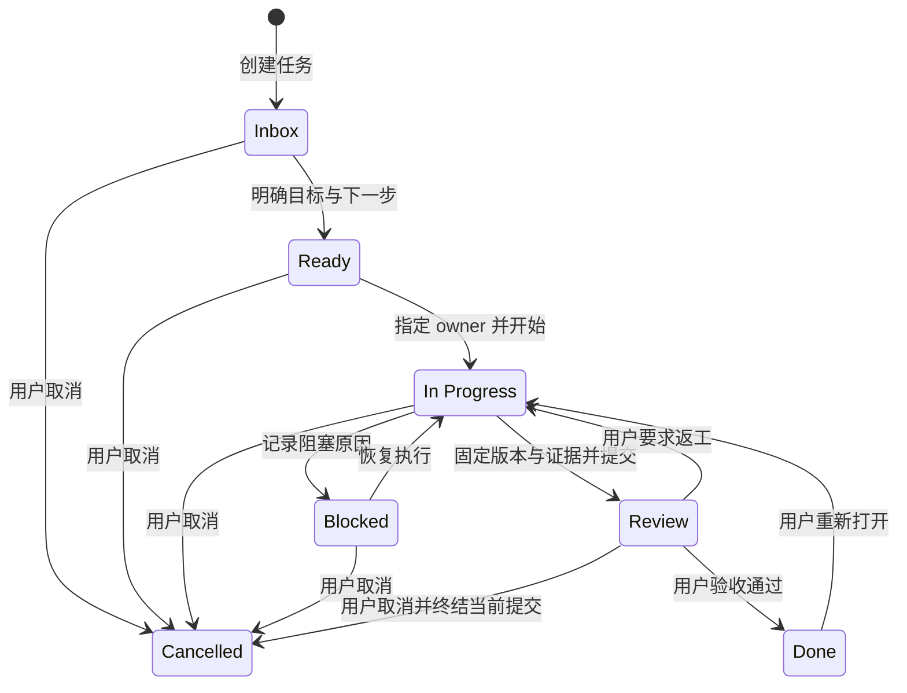

# 任务生命周期与恢复

生命周期服务于任务接续与用户验收。Workspace 可以隐式建立，Repository 关联可选；任务推进不依赖 AI、Assignment 或 Runtime。

此图表示候选主要转换，精确前置条件在 D-013/D-020 冻结；尤其要确定 Blocked 的恢复状态、Review 期间编辑/撤回，以及取消时 Submission 的原子处理。

## 接续不改变生命周期

- 任一允许记录的非终态任务可以保存 TaskCheckpoint；保存后保持原状态。
- 会话结束、模型窗口丢失或工具重启不产生 Done/Cancelled。
- 恢复先读取当前 Task、owner、证据与 Git，再参考最近 Checkpoint；缺失引用显式标注。
- 恢复旧 Checkpoint 不等于恢复旧权限，也不意味着回滚 Task 版本。

## Review 与归档

submit 为每个证据创建 Submission 独立持有的 review_evidence Link，固定 Task/criteria/evidence 版本；用户 accept/request-changes 原子写 Decision 和状态转换。Review 期间版本变化后的撤回与重提路径必须先关闭 D-020，不能仅靠严格版本检查而使任务无法返工。

Done 重新打开后新建 reviewCycle，旧验收只保留历史。归档设置 archiveState 并保留原 lifecycle；允许归档的状态与恢复规则在 D-013 冻结。首版允许用户推进并显式验收自己的普通任务，不强制引入多角色审批系统。
