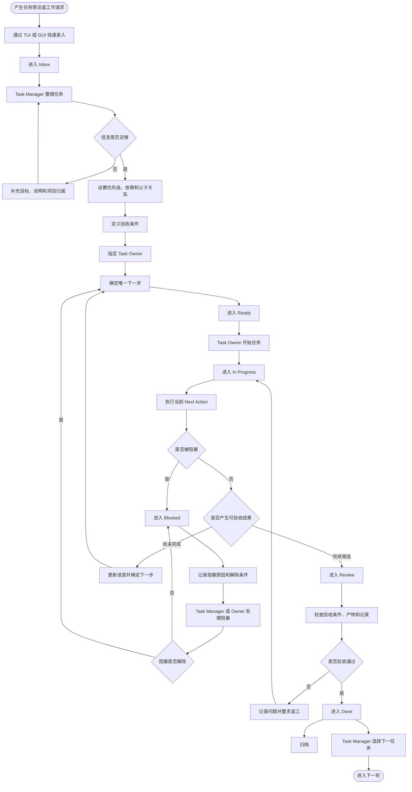

# 任务管理流程图

本流程只描述任务从收集、整理、执行、阻塞、验收到完成的生命周期，不依赖 AI 才能成立。



## 默认状态

```text
Inbox → Ready → In Progress → Blocked → Review → Done
```

`Cancelled` 和 `Archived` 是终止或收纳状态。AI 执行者未来也必须遵循同一 Task 生命周期，不能建立另一套 AI 专用任务状态。
