# 业务事实工作台架构图

> 探索 X：本文保留未来知识工作台的候选架构，不属于 V1 发布承诺，也不是 Task 创建、恢复或 Done 的前置条件。先验证简单约束与决策复用的价值，再决定是否立项；图中的完整模型仅在本探索启用后适用。事实版本绑定缺口仍需 D-023 关闭。


本图补充而不替代[任务管理器架构图](17-task-manager-architecture.md)。任务管理器负责推进工作；业务事实层负责保存不会随 Branch、Worktree 或 Commit 切换而消失的 Workspace 业务逻辑。Repository 是实现载体和证据来源，不是业务事实的唯一权威。

```mermaid
flowchart TB
    User[用户]

    subgraph Clients[交互入口]
        TUI[TUI<br/>任务、事实查询、快速确认]
        GUI[GUI<br/>业务 Wiki、场景图、漂移审查]
    end

    subgraph API[统一应用接口]
        Command[Command API]
        Query[Query API]
        Events[Event Stream]
    end

    subgraph Workbench[Workspace Core]
        Workspace[Workspace Registry]
        Facts[Business Fact Service]
        Tasks[Task Service]
        Knowledge[Wiki & Diagram Service]
        Mapping[Implementation Mapping]
        Drift[Fact Drift Detection]
        Review[Confirmation & Review]
    end

    subgraph Business[稳定业务事实层]
        System[Business System]
        Scenario[Business Scenario]
        Requirement[Requirement]
        Rule[Business Rule]
        Decision[Decision]
        Glossary[Glossary / Domain Entity]
        FactRevision[Fact Revision<br/>candidate / confirmed / superseded]
    end

    subgraph Execution[任务执行层]
        Task[Task]
        Assignment[Assignment]
        Acceptance[Acceptance Criteria]
        ReviewEvidence[Review Evidence]
    end

    subgraph Implementation[实现认知层]
        Repo[Repository]
        Component[Component / App / Service]
        ImplRef[Stable Implementation Reference]
        ImplRefRevision[Reference Revision<br/>locator at snapshot]
        MappingEntity[Implementation Mapping<br/>stable logical relation]
        Observation[Mapping Observation<br/>current / stale / missing]
        CommitSnapshot[Commit Snapshot<br/>repoId + commitSha + treeHash]
        WorktreeSnapshot[Worktree Snapshot<br/>HEAD + evidence artifacts]
    end

    subgraph GitRuntime[Git 运行现场]
        Branch[Branch]
        Worktree[Worktree]
        Commit[Commit]
        Diff[Diff / Test Result]
    end

    subgraph Storage[本地持久化]
        DB[(Workspace SQLite<br/>业务事实、任务与关系权威)]
        ArtifactLink[ArtifactLink<br/>aggregate + relationType]
        Files[(Artifact Store<br/>Wiki、证据、附件)]
        Index[(Search / Knowledge Index)]
    end

    subgraph OptionalAI[可选 AI 增强]
        Extractor[Fact & Code Extractor]
        Context[Context Brief Builder]
        Runtime[Agent Runtime Adapter]
    end

    User --> TUI
    User --> GUI
    TUI --> Command
    TUI --> Query
    GUI --> Command
    GUI --> Query
    Events --> TUI
    Events --> GUI

    Command --> Workbench
    Query --> Workbench
    Workbench --> Events

    Facts --> Business
    Tasks --> Execution
    Knowledge --> System
    Knowledge --> Scenario
    Knowledge --> ArtifactLink
    Mapping --> MappingEntity
    Drift --> Observation
    Review --> FactRevision
    Review --> Acceptance

    System --> Scenario
    Scenario --> Requirement
    Scenario --> Rule
    Requirement --> Acceptance
    Decision --> FactRevision
    Glossary --> FactRevision

    Task --> Scenario
    Task --> Requirement
    Task --> Acceptance
    Task --> Assignment
    Assignment --> Repo
    Assignment --> Component
    Assignment --> Worktree
    ReviewEvidence --> Review
    ReviewEvidence --> ArtifactLink
    FactRevision --> ArtifactLink

    Repo --> Component
    Component --> ImplRef
    ImplRef --> ImplRefRevision
    ImplRef --> MappingEntity
    MappingEntity --> Observation
    CommitSnapshot --> ImplRefRevision
    WorktreeSnapshot --> ImplRefRevision
    CommitSnapshot -->|提交树证据| Observation
    WorktreeSnapshot -->|未提交现场证据| Observation
    Branch --> Commit
    Worktree --> Commit
    Commit --> CommitSnapshot
    Worktree --> WorktreeSnapshot
    Diff --> WorktreeSnapshot
    WorktreeSnapshot --> ArtifactLink
    ArtifactLink --> DB
    ArtifactLink --> Files

    Facts <--> DB
    Tasks <--> DB
    Mapping <--> DB
    Knowledge <--> DB
    Query <--> Index

    Drift -.生成候选，不直接改事实.-> Review
    Extractor -.生成候选事实与映射.-> Review
    Context -.组合已确认事实与当前代码快照.-> Runtime
    Runtime -.通过 Assignment 执行.-> Tasks
```



## 权威边界

- Workspace 是长期知识和任务的边界，可以包含多个 Repository。
- SQLite 保存结构化业务事实、任务、确认状态、ArtifactLink、关系和版本；Wiki 与图保存在本地 Artifact Store，并通过 ArtifactLink 关联 FactRevision、Workspace Knowledge 或其他 aggregate，而不是伪造 Task。
- Business System、Scenario、Requirement、Rule 和 Decision 不使用 Branch、路径或 Commit SHA 作为身份。
- Repository、Component、API、表和 Symbol 属于实现认知层。ImplementationReference 是稳定逻辑身份；snapshot 下的路径或 Symbol locator 保存为不可变 ImplementationReferenceRevision。
- CommitSnapshot 由 repositoryId、commitSha 和 treeHash 标识提交内容；同一 commit 下不同的 index、diff 或 untracked manifest 必须形成不同 WorktreeSnapshot，不能合并为同一个快照。
- WorktreeSnapshot 使用 ArtifactLink 关联 canonical index manifest、staged/unstaged diff、untracked/submodule/sparse-checkout evidence；只有 hash 而没有可取回 Artifact 的现场不能称为长期可复核证据。
- WorktreeSnapshot 的完整多 Artifact intent 清单由 durable CaptureOperation 固定；只有全部 Blob 发布，且 startStateToken、由 evidence 派生的 evidenceStateToken 和重新读取现场得到的 endStateToken 三者一致时，才能在一个 SQLite transaction 中发布 Snapshot、全部 ArtifactLink 和计划内 Observation。任一 Blob 失败或采集中 HEAD、index、文件变化必须整体失败，不能暴露半完成 Snapshot 或以 partial 接受撕裂证据。
- V1 的 ImplementationMapping 只关联 BusinessFact 与 ImplementationReference；Scenario 通过 BusinessFact 间接获得实现视图。
- 每个 snapshot 的 current/stale/missing 以不可变 MappingObservation 追加，并绑定 Workspace baseline、Repository + selected ref、Worktree 或 release baseline 上下文；observed/expected Revision 必须属于 Mapping 的同一 ImplementationReference，observed snapshot 必须与 Observation 完全一致，expected Revision 必须来自兼容的 comparison baseline 或 last-known context。freshness 只能在同一上下文及 revision 内派生，不能原地改写历史状态、跨 Branch 取全局最新值或修改 locator。
- Git 切换只产生新的 CommitSnapshot/WorktreeSnapshot、ImplementationReferenceRevision 和 MappingObservation；不会删除或静默改写已确认业务事实及历史实现观察。
- Repo Wiki 中的稳定说明属于 Workspace Knowledge；自动扫描得到的目录、API 和依赖信息属于带版本的实现快照。
- AI 只能生成 candidate mapping、reference revision、mapping observation 或 drift finding，正式业务事实与 mapping 需要用户或授权 Reviewer 确认。

## 三个核心主对象

```text
Business Fact                   Workspace 为什么这样运作，跨 Git 版本长期存在
Task                            当前需要推进什么，以业务事实作为目标和验收依据
Implementation Evidence Snapshot 当前提交树或未提交现场怎样实现这些事实
```
