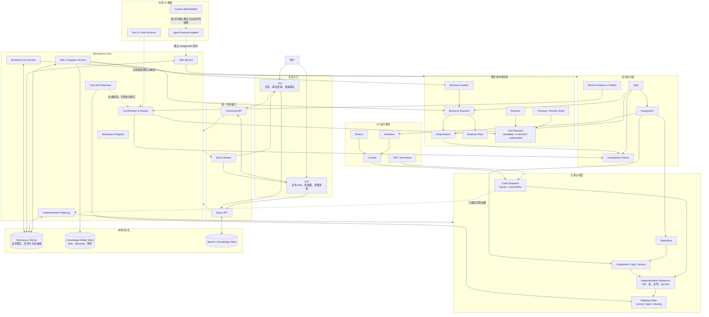

# 业务事实工作台架构图

本图补充而不替代[任务管理器架构图](17-task-manager-architecture.md)。任务管理器负责推进工作；业务事实层负责保存不会随 Branch、Worktree 或 Commit 切换而消失的项目逻辑。Repository 是实现载体和证据来源，不是业务事实的唯一权威。



## 权威边界

- Workspace 是长期知识和任务的边界，可以包含多个 Repository。
- SQLite 保存结构化业务事实、任务、确认状态、关系和版本；Wiki 与图保存在本地 Artifact Store，并由稳定 ID 引用。
- Business System、Scenario、Requirement、Rule 和 Decision 不使用 Branch、路径或 Commit SHA 作为身份。
- Repository、Component、API、表和 Symbol 属于实现认知层，必须通过带 `commitSha` 的 Code Snapshot 说明观察版本。
- Git 切换只产生新的 Code Snapshot，并更新实现映射状态；不会删除或静默改写已确认业务事实。
- Repo Wiki 中的稳定说明属于 Workspace Knowledge；自动扫描得到的目录、API 和依赖信息属于带版本的实现快照。
- AI 只能生成 candidate、mapping 或 drift finding，正式业务事实需要用户或授权 Reviewer 确认。

## 三个核心主对象

```text
Business Fact        项目为什么这样运作，跨 Git 版本长期存在
Task                 当前需要推进什么，以业务事实作为目标和验收依据
Repository Snapshot  当前代码怎样实现这些事实，随 Commit 变化
```
