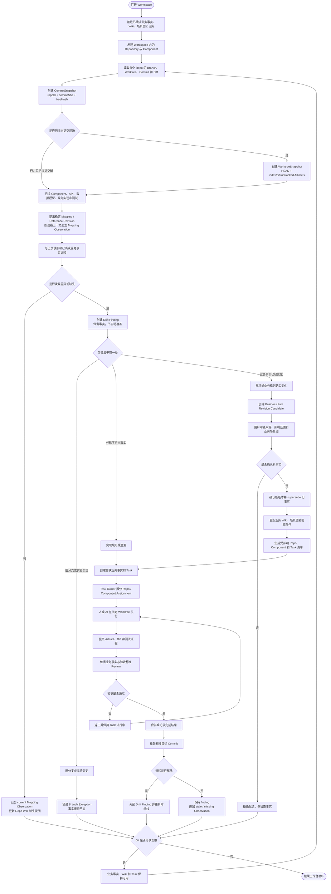

# 业务事实与 Git 变更流程图

> 探索 X：本文保留未来知识工作台的候选架构，不属于 V1 发布承诺，也不是 Task 创建、恢复或 Done 的前置条件。先验证简单约束与决策复用的价值，再决定是否立项；图中的完整模型仅在本探索启用后适用。事实版本绑定缺口仍需 D-023 关闭。

本流程补充而不替代[任务管理流程图](18-task-management-workflow.md)。它描述工作台如何在 Git 分支、Worktree 和 Commit 不断变化时，持续保存业务事实，并把代码差异转化为可确认的映射、漂移或任务。

## 分支切换不变量

无论 Git 如何切换，以下内容保持存在：

- Business System、Scenario、Requirement、Rule、Decision 和 Glossary；
- 已确认的业务 Wiki、场景图和事实版本历史；
- Task、Owner、Acceptance Criteria、Review，以及通过 ArtifactLink 关联的 Artifact；
- 稳定 ImplementationMapping、历史 ImplementationReferenceRevision/MappingObservation 和漂移记录。

切换后允许变化的是：

- 当前 Branch、Worktree、Commit 和 Diff；
- 当前代码中可观察到的 Component、API、表、Symbol 和测试结果；
- 当前 CommitSnapshot，以及每个 index/diff/untracked 现场独立的 WorktreeSnapshot；
- 从所选 Workspace baseline、Repository ref、Worktree 或 release baseline 的匹配 MappingObservation 派生的 `current / stale / missing / unobserved` 视图；
- 基于新快照产生的 Wiki、图或事实候选。

## 关键规则

1. 先加载稳定业务事实，再观察当前 Git 现场。
2. 只扫描提交树时绑定 CommitSnapshot，并明确忽略工作区 Diff；扫描 index、Diff 或未跟踪文件时必须另建 WorktreeSnapshot，并通过 ArtifactLink 保存 canonical manifest/diff Artifact，不能只保存 `repoId + commitSha` 或 hash。Worktree capture 由 durable CaptureOperation 固定完整 Artifact intent 清单；全部 Blob 发布且 start/evidence/end state token 相等后，才在一个 SQLite transaction 中发布 Snapshot、全部 Link 和计划内 Observation。不一致或任一 Blob 失败时整体失败，partial 仅用于策略性 missing evidence。
3. 发现不一致时先创建 Drift Finding，由用户判断是代码问题、事实变化还是分支例外。
4. 如果代码有问题，创建以业务事实为验收依据的 Task，并把 Repo/Worktree 约束下放到 Assignment。
5. 如果业务事实变化，创建新 revision；确认后 supersede 旧版本，不删除历史。
6. Repo Wiki 和业务场景图的 AI 更新先进入 candidate，确认后才成为长期知识。
7. 文件或 Symbol 移动产生新的 ImplementationReferenceRevision；freshness 变化在相同 contextType/contextKey/contextRevision 内追加 MappingObservation，不修改历史 locator 或 observation，也不使用其他 Branch/Worktree 的观察覆盖当前视图。
8. MappingObservation 的 observed/expected Revision 必须属于 Mapping 的同一 ImplementationReference；observed Revision 的 snapshot 必须与 Observation 完全一致。`missing` 不创建 observedReferenceRevisionId，必须通过 expectedReferenceRevisionId 指向与指定 baseline/last-known context 兼容的 revision；`current` 和 `stale` 必须引用目标 snapshot 中实际观察到的 revision。
