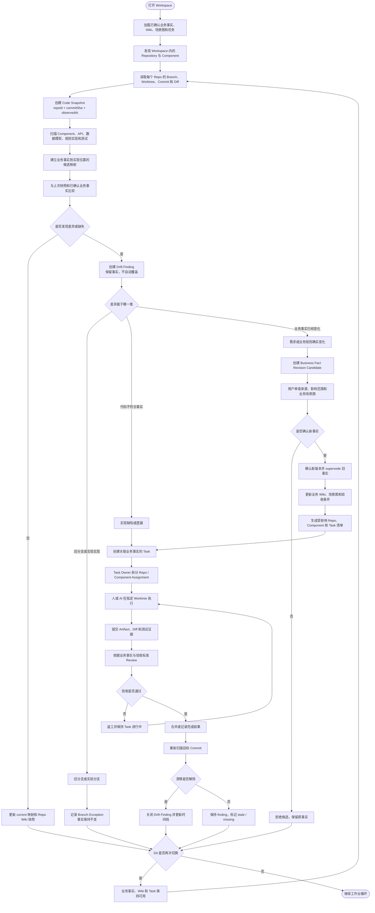

# 业务事实与 Git 变更流程图

本流程补充而不替代[任务管理流程图](18-task-management-workflow.md)。它描述工作台如何在 Git 分支、Worktree 和 Commit 不断变化时，持续保存业务事实，并把代码差异转化为可确认的映射、漂移或任务。

## 分支切换不变量

无论 Git 如何切换，以下内容保持存在：

- Business System、Scenario、Requirement、Rule、Decision 和 Glossary；
- 已确认的业务 Wiki、场景图和事实版本历史；
- Task、Owner、Acceptance Criteria、Review 和 Artifact；
- 事实与历史 Code Snapshot 的映射和漂移记录。

切换后允许变化的是：

- 当前 Branch、Worktree、Commit 和 Diff；
- 当前代码中可观察到的 Component、API、表、Symbol 和测试结果；
- 实现映射的 `current / stale / missing` 状态；
- 基于新快照产生的 Wiki、图或事实候选。

## 关键规则

1. 先加载稳定业务事实，再观察当前 Git 现场。
2. 代码扫描结果必须绑定 `repoId + commitSha`，不能覆盖没有版本信息的知识。
3. 发现不一致时先创建 Drift Finding，由用户判断是代码问题、事实变化还是分支例外。
4. 如果代码有问题，创建以业务事实为验收依据的 Task，并把 Repo/Worktree 约束下放到 Assignment。
5. 如果业务事实变化，创建新 revision；确认后 supersede 旧版本，不删除历史。
6. Repo Wiki 和业务场景图的 AI 更新先进入 candidate，确认后才成为长期知识。
